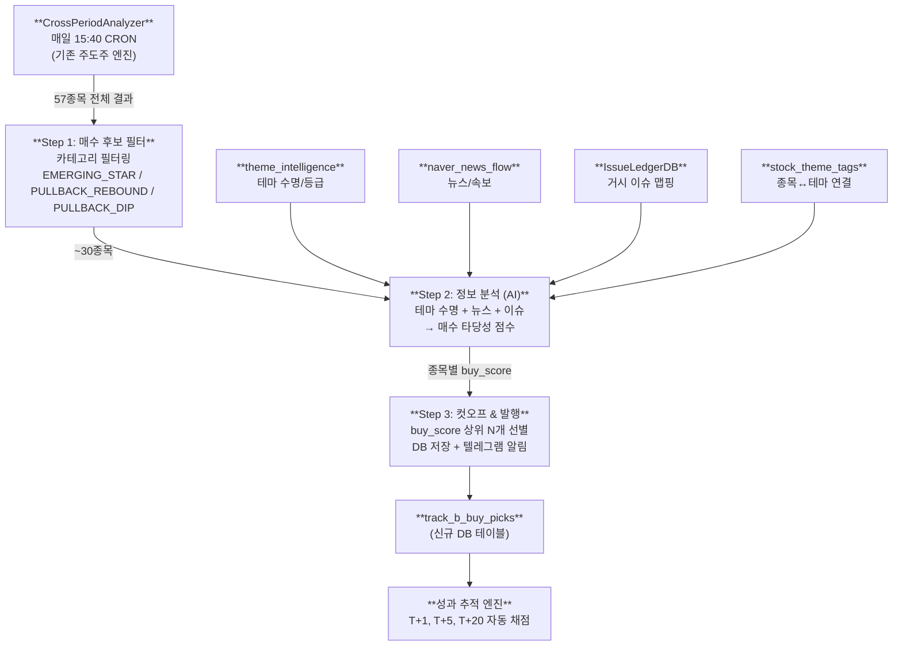
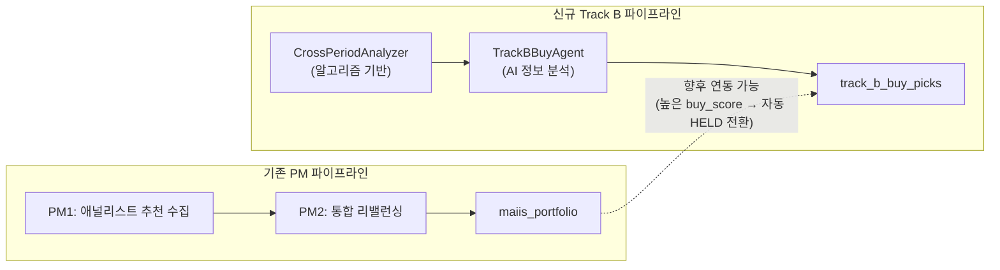

# Track B 매수 후보 선별 파이프라인 계획

> **출발점**: 주도주 메뉴 → Track B — 추천 종목 (`CrossPeriodAnalyzer`)
> **목표**: 알고리즘이 찾아낸 기술적 후보군에 **"왜 올랐는가?"** 정보 분석을 덧입혀 최종 매수 종목을 도출하고 성과를 추적

---

## 1. 현황 분석 — 이미 있는 것 vs 없는 것

### ✅ 이미 있는 것 (재활용 가능)
| 자산 | 위치 | 제공하는 것 |
|------|------|-------------|
| `CrossPeriodAnalyzer` | `v2_pipeline/CrossPeriodAnalyzer.ts` | 4기간(5/10/20/60일) α 분석, 카테고리 분류, 시그널 배지, conviction_score |
| `ThemeIntelligenceAgent` | `v2_agents/ThemeIntelligenceAgent.ts` | 테마/섹터 생애주기 분석, 주도주 뉴스 검색, Issue Ledger 연결 |
| `IssueLedgerDB` | `v2_agents/IssueLedgerDB.ts` | 거시 이슈 장부 (이슈→테마→종목 Knowledge Edge) |
| `stock_theme_tags` | DB 테이블 | 종목 ↔ 네이버 테마/섹터 매핑 (자동 태깅) |
| `theme_intelligence` | DB 테이블 | 테마별 상승 요인, 수명 타입(단기/중기/설거지), 주도주 |
| `naver_news_flow` | DB 테이블 | 당일 수집된 증권 뉴스 + 키워드 검색 뉴스 |
| `FundamentalAnalystAgent` | `v2_agents/FundamentalAnalystAgent.ts` | 증권사 리포트 기반 펀더멘털 종목 추천 |
| `PortfolioJudgeScheduler` | `v2_pipeline/PortfolioJudgeScheduler.ts` | 전략별 수익률 채점 엔진 (HIT/DROPPED) |

### ❌ 없는 것 (새로 만들어야 하는 것)
| 필요한 것 | 설명 |
|-----------|------|
| **Track B → 매수 후보 변환 에이전트** | CrossPeriod 결과에서 매수 후보 카테고리만 필터 → 정보 분석 → 최종 선별 |
| **매수 후보 전용 DB 테이블** | 기존 `maiis_portfolio`와 별도로 Track B 매수 성과를 독립 추적 |
| **성과 추적 전용 로직** | T+1, T+5, T+20 수익률 자동 기록 |
| **UI 탭 확장** | Track B 내 "매수 후보" 서브뷰 또는 별도 탭 |

---

## 2. 파이프라인 아키텍처



---

## 3. 각 단계 상세 설계

### Step 1: 매수 후보 필터 (코드 기반, AI 불필요)

CrossPeriodAnalyzer의 결과에서 **카테고리** 기준으로 매수 후보만 추출합니다.

```
입력: CrossPeriodResult.candidates (전체 ~57종목)
필터: category IN ('EMERGING_STAR', 'PULLBACK_REBOUND', 'PULLBACK_DIP')
출력: ~30종목의 매수 후보 리스트
```

**추가 필터링 조건 (가드레일)**:
- `peakoutLevel !== 'CONFIRMED'` (피크아웃 확정 종목 제거)
- `period_5d.avgTradingValue >= 5억원` (유동성 부족 종목 제거)
- 기존 `maiis_portfolio`에 이미 `HELD` 상태로 들어있는 종목 제외

> [!NOTE]
> TRUE_LEADER(진성 대장)는 이미 충분히 올라간 종목이므로 매수 후보가 아닌 **보유/관망** 대상입니다. EXHAUSTED는 당연히 제외.

### Step 2: 정보 분석 (AI 기반 — 핵심 단계)

각 후보 종목에 대해 **"왜 올랐는지"** + **"더 오를 수 있는지"**를 판단합니다.

#### 2-A. 컨텍스트 자동 수집 (DB 조회, API 호출 없음)

종목별로 아래 정보를 자동으로 조합합니다:

| 정보 소스 | 조회 방법 | 제공하는 인사이트 |
|-----------|-----------|-------------------|
| `stock_theme_tags` | 종목코드로 조회 | 이 종목이 속한 테마/섹터 목록 |
| `theme_intelligence` | 테마명으로 조회 | 해당 테마의 AI 판정 수명 (성장/피크아웃/설거지) |
| `naver_news_flow` | 종목명으로 LIKE 검색 | 최근 1~2일 관련 뉴스 헤드라인 |
| `knowledge_edges` | STOCK 타입으로 edge 조회 | 거시 이슈와의 연결 관계 |
| `CrossPeriodCandidate` | 이미 메모리에 있음 | 4기간 α, 시그널 배지, convictionScore |
| `leader_regime_snapshot` | 종목코드로 조회 | 최근 시장 주도 이력 (리더 연속일수, 레짐) |

#### 2-B. AI 판정 (Gemini 1회 호출)

> [!IMPORTANT]
> **토큰 효율**: 30종목을 개별 호출하면 30번이므로, **1회 배치 프롬프트**로 모든 후보를 한꺼번에 분석합니다.

**시스템 프롬프트 역할**: "시장 주도주 매수 전문 포트폴리오 매니저"

**프롬프트에 주입할 구조**:
```
[매수 후보 #1]
종목명: 피플바이오 (304840)
카테고리: 신흥 급부상 | 시그널: 브레이크아웃, 거래폭발
5d α: +85.1% | 10d α: +69.8% | 20d α: +74.0% | 60d α: -16.8%
거래대금(5d): 4,100M
관련 테마: 통신장비
테마 수명 판정: [성장기 — 중기 트렌드 (AI 기관매수 집중)]
최근 뉴스: "피플바이오 대규모 수주 공시..." / "통신장비 섹터 기관 순매수 1위"
이슈 연결: ISSUE-20260409-AI-인프라

[매수 후보 #2]
...
```

**AI에게 요청하는 출력**:
```json
{
  "buy_evaluations": [
    {
      "stock_code": "304840",
      "stock_name": "피플바이오",
      "buy_score": 88,
      "verdict": "BUY",
      "strategy": "MOMENTUM",
      "reason": "통신장비 테마 성장기 초입, 기관 수급 유입 확인됨. 60d α가 음수에서 반전 중이며 브레이크아웃 시그널 동시 발현.",
      "risk": "60d 기준 아직 비주도주. 테마 수명이 단기일 경우 급반락 가능성.",
      "target_return_pct": 15,
      "stop_loss_pct": -8,
      "lifespan_days": 5
    }
  ]
}
```

**verdict 옵션**:
- `BUY` — 지금 매수 적기
- `WATCH` — 관심종목으로 유지 (아직 매수는 아님)
- `SKIP` — 기각 (테마 소멸 / 이미 과열 등)

### Step 3: 컷오프 & 발행

```
AI 결과에서 verdict === 'BUY' 인 종목만 추출
→ buy_score 내림차순 정렬
→ 상위 최대 10개까지 발행
→ track_b_buy_picks 테이블에 INSERT
→ 텔레그램 알림 발송
```

---

## 4. DB 스키마 설계

### 신규 테이블: `track_b_buy_picks`

```sql
CREATE TABLE IF NOT EXISTS track_b_buy_picks (
    id INTEGER PRIMARY KEY AUTOINCREMENT,
    date TEXT NOT NULL,                    -- 매수 추천일
    stock_code TEXT NOT NULL,
    stock_name TEXT NOT NULL,
    category TEXT NOT NULL,                -- EMERGING_STAR / PULLBACK_REBOUND / PULLBACK_DIP
    signals_json TEXT,                     -- CrossPeriod 시그널 배지 (JSON 배열)
    strategy TEXT DEFAULT 'MOMENTUM',      -- AI 판정 전략
    buy_score INTEGER DEFAULT 0,           -- AI 매수 점수 (0~100)
    conviction_score INTEGER DEFAULT 0,    -- CrossPeriod 원본 점수
    reason TEXT,                           -- AI 매수 사유
    risk TEXT,                             -- AI 리스크 요약
    related_themes_json TEXT,              -- 관련 테마 (JSON)
    theme_lifespan TEXT,                   -- 테마 수명 판정
    entry_price REAL DEFAULT 0,            -- 추천 시점 종가 (진입 기준가)
    current_price REAL DEFAULT 0,
    target_return_pct REAL DEFAULT 0,
    stop_loss_pct REAL DEFAULT 0,
    lifespan_days INTEGER DEFAULT 5,
    -- 성과 추적 필드 (자동 채점)
    t1_return REAL,                        -- T+1일 수익률
    t5_return REAL,                        -- T+5일 수익률
    t20_return REAL,                       -- T+20일 수익률
    t1_peak REAL,                          -- T+1 최고 수익률
    t5_peak REAL,
    t20_peak REAL,
    result TEXT DEFAULT 'ACTIVE',          -- ACTIVE / HIT / STOPPED / EXPIRED
    result_return REAL,                    -- 최종 수익률
    result_date TEXT,                      -- 결과 확정일
    created_at TEXT NOT NULL,
    updated_at TEXT NOT NULL,
    UNIQUE(date, stock_code)
);
```

> [!TIP]
> `maiis_portfolio`와 **완전히 분리**된 테이블입니다. 기존 PM 시스템에 영향 없이 독립적으로 Track B 매수 성과를 추적합니다.

---

## 5. 성과 추적 엔진

### 일일 자동 채점 (15:40 CRON, PortfolioJudgeScheduler에 Hook)

```
For each ACTIVE pick in track_b_buy_picks:
  1. 키움 API로 현재가 조회
  2. entry_price 대비 수익률 계산
  3. T+1/T+5/T+20 경과일에 따라 해당 필드 업데이트
  4. 전략별 기준으로 HIT / STOPPED / EXPIRED 자동 판정
```

**판정 기준** (기존 `PortfolioJudgeScheduler.judgeByStrategy`와 동일 규칙 재활용):

| 전략 | HIT (고가/종가) | 손절 | 수명 |
|------|----------------|------|------|
| MOMENTUM | +13% / +10% | -8% | 5일 |
| PULLBACK | +18% / +15% | -10% | 10일 |
| SWING | +25% / +20% | -12% | 20일 |

---

## 6. 스케줄링 & 실행 타이밍

```
15:40  PortfolioJudgeScheduler.runDailyJudgement() (기존)
       ↓ 완료 후
15:45  CrossPeriodAnalyzer → 스냅샷 갱신
       ↓
15:50  TrackBBuyAgent.runDailySelection()  ← 신규
       ├── Step 1: 필터
       ├── Step 2: AI 분석 (Gemini 1회)
       └── Step 3: 저장 + 텔레그램
       
15:55  TrackBBuyTracker.runDailyScoring()  ← 신규
       └── 기존 ACTIVE 매수 종목 수익률 채점
```

---

## 7. UI 확장 계획

### Option A: Track B 탭 내 서브뷰
현재 Track B 탭의 상단 필터 칩 바에 **"🎯 매수 후보"** 칩을 추가하여, 클릭 시 `track_b_buy_picks`의 ACTIVE 종목만 별도로 표시합니다.

### Option B: 별도 탭
사이드바에 "매수 AI" 메뉴를 추가하고, 매수 후보 리스트 + 히스토리 + 승률 대시보드를 조합한 전용 화면을 구현합니다.

### 성과 대시보드 (어떤 옵션이든 포함)
- 총 추천 수 / HIT 수 / 승률
- 평균 수익률 / 최대 수익률
- 카테고리별(신흥/눌림반등/눌림목) 승률 비교
- 전략별(MOMENTUM/PULLBACK/SWING) 승률 비교

---

## 8. 기존 PM 파이프라인과의 관계



> [!IMPORTANT]
> **현재 단계에서는 두 파이프라인을 완전히 독립**으로 운영합니다.
> Track B가 충분한 성과 데이터를 축적한 후, 높은 승률의 종목을 PM 파이프라인의 매수 포지션으로 자동 승격시키는 브릿지를 추후에 구현할 수 있습니다.

---

## 9. 구현 우선순위

| 순서 | 작업 | 예상 난이도 |
|------|------|------------|
| 1 | DB 테이블 `track_b_buy_picks` 생성 | ⭐ |
| 2 | `TrackBBuyAgent.ts` 신규 에이전트 작성 (Step 1~3) | ⭐⭐⭐ |
| 3 | CRON 스케줄 등록 (V2PipelineManager 또는 SchedulerService) | ⭐ |
| 4 | 성과 추적 로직 (PortfolioJudgeScheduler에 Hook 또는 별도 트래커) | ⭐⭐ |
| 5 | 텔레그램 알림 | ⭐ |
| 6 | UI (Track B 탭 내 매수 후보 뷰 + 성과 대시보드) | ⭐⭐⭐ |

---

## 10. 핵심 설계 원칙 요약

1. **Track B CrossPeriodAnalyzer가 유일한 입력** — PM 파이프라인의 애널리스트 추천과 무관
2. **알고리즘(양적) + AI(질적) 2단계** — 기술적 필터는 코드가, 정보 분석은 AI가 담당
3. **독립 성과 추적** — `maiis_portfolio`와 분리된 전용 테이블로 Track B만의 승률 측정
4. **토큰 효율** — 30종목을 1회 배치 프롬프트로 처리 (개별 호출 X)
5. **기존 인프라 최대 재활용** — 테마 수명, 뉴스, 이슈 장부 등 이미 수집된 데이터 활용
