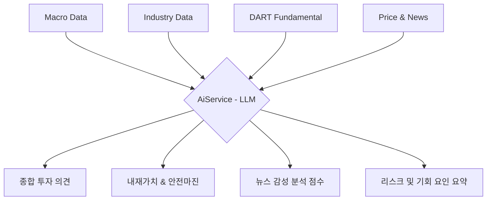

# API 통합 및 데이터 확장 가이드 (Value Quant 고도화)

본 문서는 Kiwoom Trader 프로젝트의 분석 엔진을 'Value Quant' 수준으로 격상시키기 위한 외부 API 통합 계획과 데이터 구조를 정의합니다.

---

## 1. 데이터 레이어 및 분석 흐름 (Top-Down)

AI 분석 서비스(`AiService`)가 종합적인 판단을 내릴 수 있도록 아래 4단계의 데이터를 수집하고 통합합니다.

### [1단계] 거시 환경 (Macro Context)
*   **목적:** "지금 주식을 사기에 안전한 시장인가?" 판단
*   **데이터 소스:**
    *   **한국은행 ECOS:** 기준금리, M2 통화량, 소비자물가지수(CPI)
    *   **FRED (US Fed):** 미 국채 장단기 금리차 (T10Y2Y), 달러 인덱스 (DXY), 글로벌 원자재 가격
*   **AI 활용:** 시장 할인율 결정 및 공격적/보수적 투자 비중 제안

### [2단계] 산업 분석 (Industry Context)
*   **목적:** "해당 종목이 속한 산업의 매력도와 위치는?" 판단
*   **데이터 소스:**
    *   **공공데이터포털 (금융위):** KRX 상장종목정보 (표준산업분류코드 KOSIC 매핑)
    *   **KRX 정보데이터시스템:** 업종별 평균 PER, PBR, ROE 벤치마크 데이터
*   **AI 활용:** 산업 내 순위 산출 및 '업종 내 1등주' 판별

### [3단계] 기업 펀더멘털 (Fundamental - DART)
*   **목적:** "기업 자체가 돈을 잘 벌고 재무적으로 건강한가?" 판단
*   **데이터 소스:**
    *   **DART (OpenDART):** 10년치 재무제표 (손익계산서, 재무상태표, 현금흐름표)
*   **AI 활용:** ROE 추세, 이익 안정성, 부채 비율 기반의 '퀄리티' 점수 산출

### [4단계] 밸류에이션 및 뉴스 (Valuation & Sentiment)
*   **목적:** "현재 가격이 싼가? 그리고 최근 분위기(재료)는 어떤가?" 판단
*   **데이터 소스:**
    *   **yahoo-finance2 (Node.js):** 10개년 수정 주가 히스토리 (P/E, P/B Band 산출용)
    *   **네이버 뉴스 검색 API:** 종목별 최신 기사 및 속보 수집
*   **AI 활용:** 
    *   역사적 밸류에이션 하단 진입 여부 판단
    *   뉴스 텍스트 분석을 통한 긍정/부정 감성 점수 (Sentiment Score) 부여

---

## 2. API별 상세 연동 규격 (무료 위주)

| 서비스명 | 기술/라이브러리 | 주요 엔드포인트 / 파라미터 | 비고 |
| :--- | :--- | :--- | :--- |
| **네이버 뉴스** | `axios` | `v1/search/news.json?query={종목명}&display=20&sort=sim` | 일 25,000건 무료 |
| **한국은행 ECOS** | `axios` | `StatisticSearch/{Key}/json/kr/1/10/060Y001/DD/20240101/20241231/0101000` | 기준금리 등 수집 |
| **FRED** | `axios` | `series/observations?series_id=T10Y2Y&api_key={Key}&file_type=json` | 글로벌 경기 지표 |
| **Yahoo Finance** | `yahoo-finance2` | `yahooFinance.chart(symbol, { period1, period2, interval: '1d' })` | 10년 주가 밴드용 |

---

## 3. AI 종합 분석 아키텍처 (Future Design)

AI는 수집된 파편화된 데이터를 아래와 같은 구조로 결합하여 최종 리포트를 생성합니다.

### AI 분석 프롬프트 주입 데이터 예시:
> "현재 한국 기준금리는 3.5%이며 시장 유동성(M2)은 감소세입니다. [삼성전자]의 10년 평균 ROE는 15%이나 현재 P/E 밴드는 역사적 최하단(PER 8배)에 위치해 있습니다. 최근 '반도체 업황 개선' 관련 뉴스가 80% 이상의 긍정적 비중을 보이고 있습니다. 이 데이터를 종합하여 퀀트 관점에서 분석 리포트를 작성하세요."

---

## 4. 구현 가이드라인
1.  **캐싱 우선:** 매크로 및 재무 데이터는 일 1회 또는 주 1회만 업데이트하여 API 호출 효율화.
2.  **비동기 병렬 처리:** 뉴스 검색과 주가 밴드 계산을 병렬(`Promise.all`)로 처리하여 리포트 생성 속도 최적화.
3.  **에러 핸들링:** 특정 API(예: 덕덕고 보조 링크 등) 실패 시에도 핵심 분석(DART/시세)은 중단되지 않도록 예외 처리.
