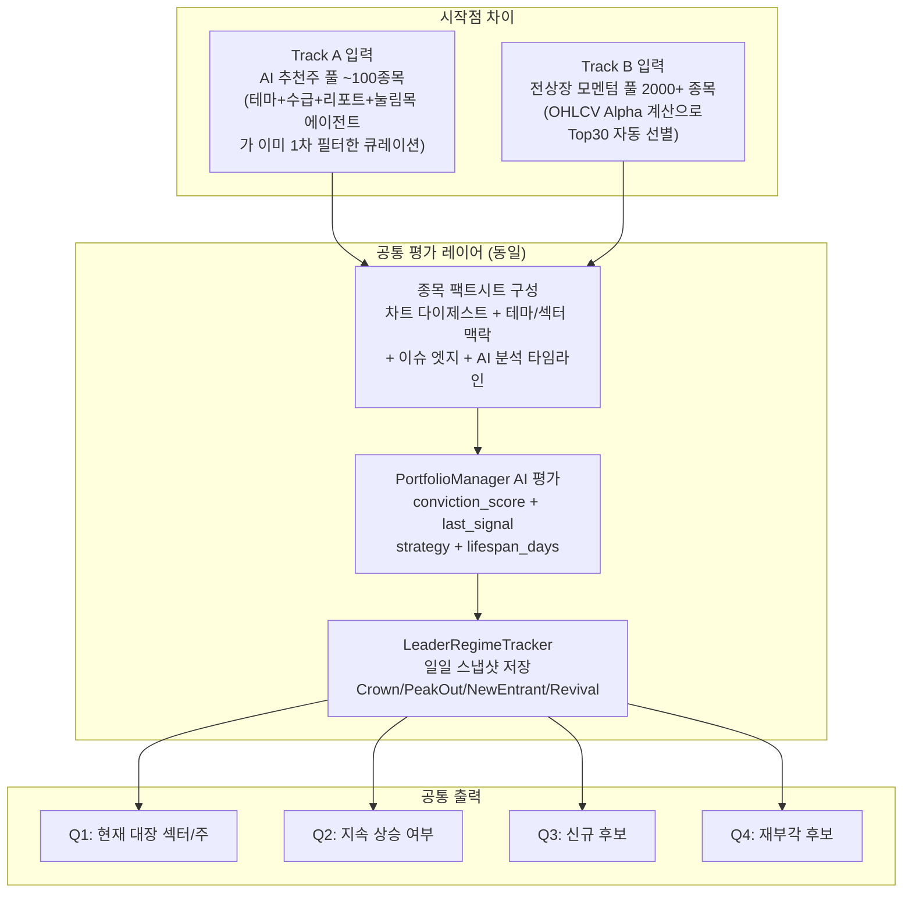

# 🏆 대장주/섹터 발굴 시스템 — 2-Track 전략 계획서 (v2)

> **작성일**: 2026-04-06 (v2 수정)
> **목적**: 4대 핵심 투자 질문에 답하는 두 시작점을 비교 실험하여, 어느 방식이 더 효율적/성과가 좋은지 검증
> **핵심 관점**: 두 트랙은 **시작점(종목 유니버스)만 다를 뿐**, 평가 방법론과 LeaderRegime 판단은 동일하게 공유한다.

---

## 🎯 4대 핵심 목표 정의

| # | 질문 | 성격 |
|:--:|------|------|
| Q1 | **지금 대장 섹터와 대장주는 무엇인가?** | 현재 상태 포착 |
| Q2 | **현재 대장주가 더 상승할 것인가?** | 지속성 판단 |
| Q3 | **새롭게 부각 중인 대장주 후보는?** | 신규 진입 탐지 |
| Q4 | **지나간 대장 중 재상승할 것은?** | 재부각 감지 |

---

## 📐 2-Track 개념도 — 시작점만 다르고, 중간부터 합류

> [!IMPORTANT]
> 두 트랙은 서로 다른 방법론이 아닙니다.
> **"어떤 종목을 평가 대상에 올릴 것인가"(입력 풀)** 만 다르고,
> 평가 방식(차트/테마/이슈/Alpha), 판정(PortfolioManager), 추적(LeaderRegimeTracker)은 동일하게 사용합니다.



---

## Track A — AI 추천주 풀 시작점

### 현재 파이프라인 정확한 현황

**이미 작동 중인 것 (수정 필요 없음)**:

| 기능 | 실제 코드 위치 | 내용 |
|------|--------------|------|
| 테마/섹터별 종목 분석 | `ThemeIntelligenceAgent` | S/A/B 등급 + 생애주기별로 구분해서 stock_picks 생산 |
| 차트 기술적 분석 | `PM L168: analyzer.generateStockDigest()` | 200일봉 MA/CCI/이격도/거래량 등 종목별 차트 다이제스트 |
| 기간 내 상승률 비교 | `PM L252~265: Alpha Top15 조회` | 전일 기준 10일 Alpha 랭킹을 PM 판단 컨텍스트로 이미 활용 |
| 이슈/테마 맥락 | `PM L174~200: theme_sector_context` | 종목별 테마 태그 → theme_intelligence 조인 → 이슈 엣지 |
| 수혜/피해 섹터 | `PM L285~295: criticalIssues` | 이슈AI 판정 수혜/피해 섹터를 PM 프롬프트에 주입 |
| 다중 에이전트 교차 | `PM L313~339: 시스템 프롬프트` | MOMENTUM/THEME/REPORT/PULLBACK 중복 추천 시 conviction_score 가산 |

**실제로 부족한 것 (A트랙에서 추가해야 할 것)**:

| 갭 | 현재 상태 | 영향 |
|----|----------|------|
| **섹터 대장 집계 뷰** | 4개 에이전트 picks를 통합한 "어떤 섹터가 오늘 가장 많이 추천받았나" 집계 없음 | Q1 답변 불가 |
| **PM 재평가 주기** | `runDailyReview()`가 매일 1회 전체 평가 — HOLD 종목의 "지속 상승 여부" 중간 점검 없음 | Q2 답변 불완전 |
| **conviction 이력** | PM이 매일 판정하지만 날짜별 conviction_score 히스토리 저장 없음 | Q2/Q3/Q4 불가 |

---

### A트랙 보완 계획 — 구체적 변경/추가 사항

#### A-1. 섹터 대장 집계 뷰 (신규 쿼리 + UI)

**파일**: `electron/services/DatabaseService.ts` + `src/components/v2_dashboard/PortfolioTab.tsx`

**추가할 것**: `ai_analyst_picks` 테이블에서 오늘 날짜 기준 섹터별 집계 쿼리

```sql
-- A트랙 대장 섹터 Top5 집계 쿼리 (신규 추가)
SELECT
    theme_sector,
    COUNT(DISTINCT stock_code) as stock_count,
    COUNT(DISTINCT agent_type) as agent_count,  -- 몇 개 에이전트에서 동시 추천됐는가
    AVG(confidence) as avg_confidence,
    GROUP_CONCAT(stock_name) as stocks
FROM ai_analyst_picks
WHERE date = ? AND agent_type IN ('MOMENTUM', 'THEME', 'REPORT', 'PULLBACK')
GROUP BY theme_sector
ORDER BY agent_count DESC, stock_count DESC
LIMIT 5;
```

> 핵심: `agent_count`가 높은 섹터 = 여러 에이전트가 동시에 주목한 섹터 = A트랙 대장 섹터

---

#### A-2. HOLD 종목 재평가 트리거 (PM 경량 재실행)

**파일**: `electron/services/v2_pipeline/PortfolioJudgeScheduler.ts`
**신규 메서드**: `electron/services/v2_agents/PortfolioManagerAgent.ts` → `runMiniReview()`

**현재**: 매일 장마감 후 수익률/수명만 체크 (HIT/DROPPED 판정)
**추가**: 수명 50% 경과 + HOLD 상태 종목에 대해 PM을 경량 재호출

```typescript
// PortfolioJudgeScheduler.ts에 추가 — 13:00 또는 장마감 Judge 병행 실행
const holdStocksNeedReview = activePortfolio.filter(s =>
    s.status === 'HOLD' &&
    s.last_signal === 'HOLD' &&
    s.days_held >= Math.floor((s.lifespan_days || 20) * 0.5) // 수명 50% 경과
);
// → PM.runMiniReview(holdStocksNeedReview) 호출 (신규 메서드)
```

**`runMiniReview()` 동작**:
1. 대상 종목만 Dossier 재구성 (차트 digest + 최신 Alpha 순위 변화)
2. "여전히 Alpha Top20 안에 있는가?" + "테마 생애주기 변화 있는가?" 체크
3. CONTINUE_HOLD / DROP 중 택1 → `maiis_portfolio` 업데이트

---

#### A-3. conviction_score 이력 저장 (LeaderRegime 합류)

**파일**: `electron/services/DatabaseService.ts`
**현재**: `maiis_portfolio`에 `conviction_score` 저장되지만 날짜별 이력 없음

```sql
-- 신규 테이블: portfolio_score_history (A트랙 LeaderRegime 기록)
CREATE TABLE IF NOT EXISTS portfolio_score_history (
    id INTEGER PRIMARY KEY AUTOINCREMENT,
    snapshot_date TEXT NOT NULL,
    stock_code TEXT NOT NULL,
    stock_name TEXT NOT NULL,
    conviction_score INTEGER,
    last_signal TEXT,          -- IMMEDIATE_BUY / HOLD / WAIT_DIP / DROP
    strategy TEXT,
    analysts_json TEXT,        -- 오늘 추천한 에이전트 목록
    theme_sector TEXT,
    market_alpha REAL,         -- 당일 Alpha (B트랙에서 가져옴)
    created_at TEXT DEFAULT (datetime('now', 'localtime'))
);
```

이 테이블이 쌓이면:
- Q2: conviction_score 연속 3일 상승 종목 → "A트랙 대장 확정"
- Q3: 어제 없었는데 오늘 처음 80점 이상으로 진입한 종목 → "신규 추천 대장 후보"
- Q4: 과거 90점 후 하락, 다시 80점 진입 → "재부각"

---

## Track B — 전상장 모멘텀 시작점

### 현재 파이프라인 정확한 현황

**이미 작동 중인 것**:

| 기능 | 실제 코드 위치 | 내용 |
|------|--------------|------|
| Alpha 계산 | `MarketLeaderDiscoveryService.getMarketLeaders()` | 전종목 OHLCV → (종목수익률 - 지수수익률) × 유동성가중 |
| 테마/섹터 역산출 | `MarketLeaderDiscoveryService L98~168` | `daily_rising_stocks` 테이블의 theme_sector/tags 필드 역산출 |
| 온톨로지 정규화 | `ThemeOntologyAgent` | 파편화 태그 → 대분류 치환 후 MarketLeadersTab에 표시 |
| 기간별 조회 | `MarketLeadersTab` UI | 5일/10일/20일/60일 선택 → Alpha Top30 + 주도섹터 랭킹 |

**B트랙이 A트랙과 다른 핵심**:
- **A트랙**: 에이전트 AI가 "왜 이 종목인가"를 판단한 후 PM에 올림
- **B트랙**: 시장 가격 데이터가 "이 종목이 시장을 이기고 있다"는 사실을 먼저 포착 후 PM에 올림

> [!NOTE]
> **섹터/테마 구분**: `MarketLeaderDiscoveryService` L98~168에서 `daily_rising_stocks`의 `theme_sector`와 `tags`를 역산출해 테마별 랭킹을 이미 만들고 있습니다. `ThemeOntologyAgent`가 파편화 태그를 대분류로 정규화한 결과도 반영됩니다.
> **부족한 것은 섹터 구분 자체가 아니라, "이 섹터가 왜 오르는가(뉴스/호재)"에 대한 맥락입니다.**

**실제로 부족한 것**:

| 갭 | 현재 상태 | 영향 |
|----|----------|------|
| **일일 스냅샷 저장** | 매번 런타임 계산, 어제 순위와 비교 불가 | Q2/Q3/Q4 불가 |
| **뉴스/호재 맥락** | 가격 데이터만으로 "왜 오르는가" 설명 없음 | B트랙 단독으로는 AI 판단 품질 낮음 |
| **PM 연동** | MarketLeadersTab은 조회 전용, PM에 B트랙 종목 주입 없음 | B트랙 시작점 → 공통 평가 합류 미구현 |

### B트랙 뉴스 활용 방침

B트랙의 Alpha 상위 종목을 PM에 올릴 때, 뉴스 없이 가격 데이터만으로 판단하면 AI가 "왜 오르는지 근거가 없다"고 DROP 판정할 수 있습니다.

**해결책**: B트랙도 Dossier 구성 시 이미 수집된 뉴스 캐시 활용

```
B트랙 Dossier 구성 순서:
1. Alpha + 차트 다이제스트 (TechnicalAnalyzer — A트랙과 동일)
2. Reverse Theme Lookup으로 확인한 섹터 맥락
3. NewsDataHub.getNewsForIssue(종목명/테마명) — 장전 수집 캐시, 추가 API 호출 없음
4. IssueLedgerDB에서 해당 테마의 이슈 엣지 조회 (A트랙과 동일)
```

A트랙과 동일한 `TechnicalAnalyzer` + `NewsDataHub` + `IssueLedgerDB`를 사용하므로, Dossier 품질은 거의 동일해집니다. **차이는 입력 종목 유니버스뿐.**

---

### B트랙 보완 계획 — 구체적 변경/추가 사항

#### B-1. 일일 스냅샷 저장 (모든 Q의 기반)

**파일**: `electron/services/v2_pipeline/MarketLeaderDiscoveryService.ts`

```typescript
// 신규 메서드: saveSnapshot()
public saveSnapshot(leaders: MarketLeaderItem[], periodDays: number): void {
    const db = (this.dbService as any).db;
    const today = this.dbService.getKstDate();

    db.prepare(`CREATE TABLE IF NOT EXISTS market_leader_daily (
        id INTEGER PRIMARY KEY AUTOINCREMENT,
        snapshot_date TEXT NOT NULL,
        period_days INTEGER NOT NULL,
        stock_code TEXT NOT NULL,
        stock_name TEXT NOT NULL,
        rank INTEGER NOT NULL,
        market_alpha REAL,
        total_change_rate REAL,
        avg_trading_value REAL,
        score REAL,
        related_themes TEXT,
        created_at TEXT DEFAULT (datetime('now', 'localtime'))
    )`).run();

    db.prepare(`CREATE UNIQUE INDEX IF NOT EXISTS idx_leader_daily
        ON market_leader_daily(snapshot_date, period_days, stock_code)`).run();

    const stmt = db.prepare(`
        INSERT OR REPLACE INTO market_leader_daily
        (snapshot_date, period_days, stock_code, stock_name, rank, market_alpha,
         total_change_rate, avg_trading_value, score, related_themes)
        VALUES (?, ?, ?, ?, ?, ?, ?, ?, ?, ?)
    `);

    leaders.forEach((l, idx) => {
        stmt.run(today, periodDays, l.stockCode, l.stockName, idx + 1,
            l.marketAlpha, l.totalChangeRate, l.avgTradingValue, l.score,
            JSON.stringify(l.relatedThemes));
    });
}
```

**호출 위치**: `PortfolioJudgeScheduler.runDailyJudgement()` 마지막에 추가 (15:40)

---

#### B-2. LeaderRegime 파생 분석 메서드

**파일**: `electron/services/v2_pipeline/MarketLeaderDiscoveryService.ts`

```typescript
// Q2: Crown 연속일 — 연속 Top10 유지 종목
public getCrownLeaders(minDays: number = 3): any[] { ... }

// Q3: 신규 진입자 — 오늘 Top30이었는데 어제 없던 종목
public getNewEntrants(): any[] { ... }

// Q4: Revival 후보 — 20일 전 Top15였다가 소강 후 재진입
public getRevivalCandidates(pastDays: number = 20): any[] { ... }
```

---

#### B-3. B트랙 종목 PM 주입 (핵심: 공통 평가 합류)

**파일**: `electron/services/v2_agents/PortfolioManagerAgent.ts` — `runDailyReview()` 내부

```typescript
// L69 이후에 추가: B트랙 Alpha Top30 종목을 evalPool에 병합
const bTrackLeaders = MarketLeaderDiscoveryService.getInstance().getMarketLeaders(10, 0, 30);

bTrackLeaders.forEach(leader => {
    if (!evalPool[leader.stockName]) {
        // A트랙에 없는 종목: B트랙 전용으로 추가
        evalPool[leader.stockName] = {
            source: 'B_TRACK_ALPHA',
            analysts: [{ agent: 'MARKET_MOMENTUM', reason: `Alpha Top${rank}: ${alpha}% 초과수익` }]
        };
    } else {
        // A트랙에 이미 있는 종목: 교차 확인 표시
        evalPool[leader.stockName].source = 'A_AND_B_TRACK';
        evalPool[leader.stockName].b_track_rank = rank;
    }
});
```

**PM 프롬프트 추가 지침**:
- `source: A_AND_B_TRACK` → AI 추천 + 시장 가격 모두 확인 → conviction_score +15점
- `source: B_TRACK_ALPHA` → 차트와 테마/뉴스 캐시만으로 판단 (AI 추천 없음)

---

## 📊 두 트랙 비교 매트릭스

| 비교 항목 | Track A (AI 추천주 풀) | Track B (전상장 모멘텀) |
|:----------|:-------------------|:-----------------------|
| **시작 종목 수** | ~100종목 (4개 에이전트 1차 필터) | 전상장 2000+ → Alpha Top30 자동 선별 |
| **섹터/테마 구분** | ✅ ThemeIntelligenceAgent (S/A/B 등급, 생애주기) | ✅ Reverse Theme Lookup (daily_rising_stocks 역산출) |
| **차트 분석** | ✅ PM Dossier에서 TechnicalAnalyzer 이미 활용 | ✅ 동일한 TechnicalAnalyzer 사용 |
| **뉴스/호재** | ✅ NaverNews + NewsDataHub (에이전트별 수집) | ⚠️ NewsDataHub 캐시 조회로 보완 가능 |
| **기간 내 상승률** | ✅ PM에서 Alpha Top15 이미 활용 (L252~265) | ✅ Alpha 계산 자체가 핵심 |
| **AI 해석 품질** | ✅ 높음 (에이전트가 이미 필터) | ⚠️ 보통 (가격 먼저, Dossier 보완 필요) |
| **Q1 대장섹터** | ⚠️ 섹터 집계 뷰 신규 추가 필요 | ✅ 이미 작동 (주도섹터 랭킹) |
| **Q2 지속성** | ❌ conviction 이력 저장 필요 | ❌ 스냅샷 저장 필요 |
| **Q3 신규 후보** | ⚠️ Theme lifecycle + conviction 신규진입 | ❌ 스냅샷으로 NewEntrant 감지 |
| **Q4 재부각** | ⚠️ Incubator + conviction 복귀 패턴 | ❌ Revival 쿼리 필요 |
| **PM 판정** | ✅ 이미 연동 | ❌ B트랙 주입 구현 필요 |

> [!TIP]
> **성과 비교 가설**: A트랙은 False Positive(AI가 추천했지만 안 오른 종목)가 적고, B트랙은 False Negative(AI가 놓쳤지만 실제로 오른 종목)가 적을 것. 교집합(`A_AND_B_TRACK`) 종목이 가장 신뢰도가 높을 것.

---

## 🗺️ 구현 로드맵

### Step 0: 공통 기반 — 스냅샷 저장 ★☆☆ (두 트랙 모두 필요)
- [ ] `market_leader_daily` 테이블 DDL + `saveSnapshot()` 메서드
- [ ] `portfolio_score_history` 테이블 DDL
- [ ] `PortfolioJudgeScheduler` 15:40 스냅샷 저장 크론 추가
- [ ] PM `runDailyReview()` 완료 후 conviction_score 이력 저장
- [ ] LeaderRegime 파생 쿼리 3종 (`getCrownLeaders`, `getNewEntrants`, `getRevivalCandidates`)

### Step 1: A트랙 보완 ★★☆
- [ ] `getSectorSummaryFromPicks(date)` DB 메서드
- [ ] 섹터 집계 UI 위젯 (agent_count 기준 랭킹)
- [ ] `runMiniReview(stocks[])` 경량 PM 재평가 메서드
- [ ] 13:00 Mini Review 크론 (수명 50%+ HOLD 종목)

### Step 2: B트랙 보완 ★★☆
- [ ] B트랙 → PM evalPool 주입 로직 (`runDailyReview()` 내)
- [ ] B트랙 Dossier 구성 시 NewsDataHub 캐시 + IssueLedgerDB 연동
- [ ] PM 프롬프트에 `B_TRACK_ALPHA` / `A_AND_B_TRACK` 처리 지침 추가

### Step 3: UI 강화 ★★☆
- [ ] `MarketLeadersTab` 종목 행에 LeaderRegime 뱃지 (`🏆 Crown`, `🆕 신규`, `🔄 복귀`)
- [ ] 섹터 랭킹 카드에 트렌드 방향 (`▲ 3일 연속 1위`, `🆕 오늘 진입`)
- [ ] A/B트랙 교집합 종목 하이라이트 (`A_AND_B_TRACK` 표시)
- [ ] AI 브리핑 영역 실데이터 활성화 (로컬 AI 연동)

---

## 🏁 4대 질문 답변 매핑

| 질문 | A트랙 (보완 후) | B트랙 (보완 후) | 교집합 |
|------|:-----:|:-----:|:-------:|
| Q1 현재 대장? | picks 섹터 집계 Top3 | Alpha 섹터 랭킹 Top5 | 양쪽 모두 Top3 = 최고 신뢰 |
| Q2 더 오를까? | conviction_score 연속 상승 + Mini Review | Crown 연속 Top10 + PeakOut | A+B 모두 HOLD = 강한 확신 |
| Q3 신규 후보? | conviction 신규 80점 진입 + Theme '발생' | NewEntrant Alpha 신규 진입 | 양쪽 동시 진입 = 빠른 편입 |
| Q4 재부각? | Incubator IGNITE + conviction 복귀 | Revival Alpha 복귀 패턴 | 인큐베이터 + 시장 동시 확인 |
