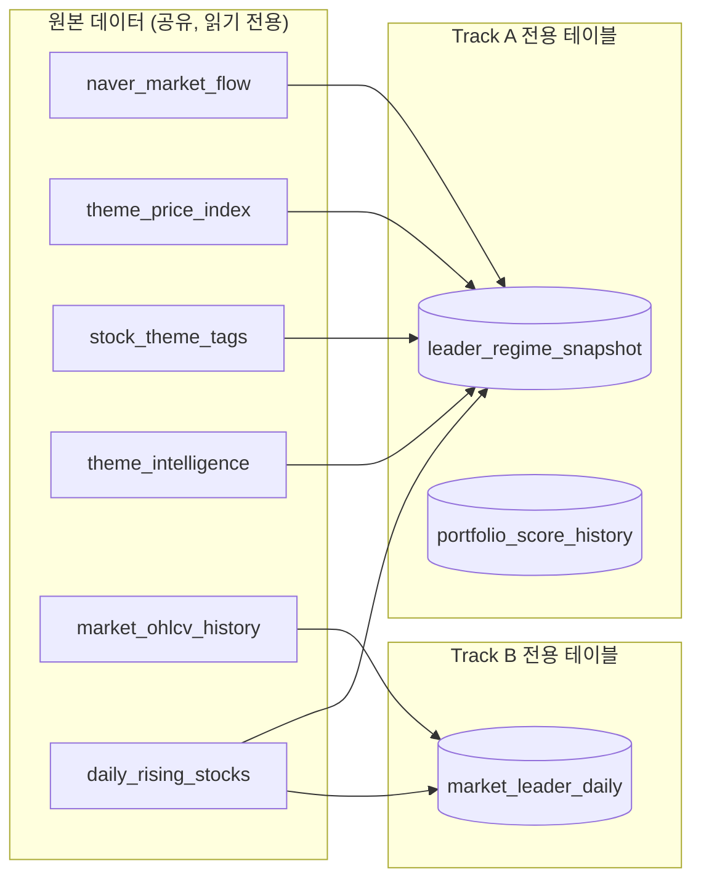
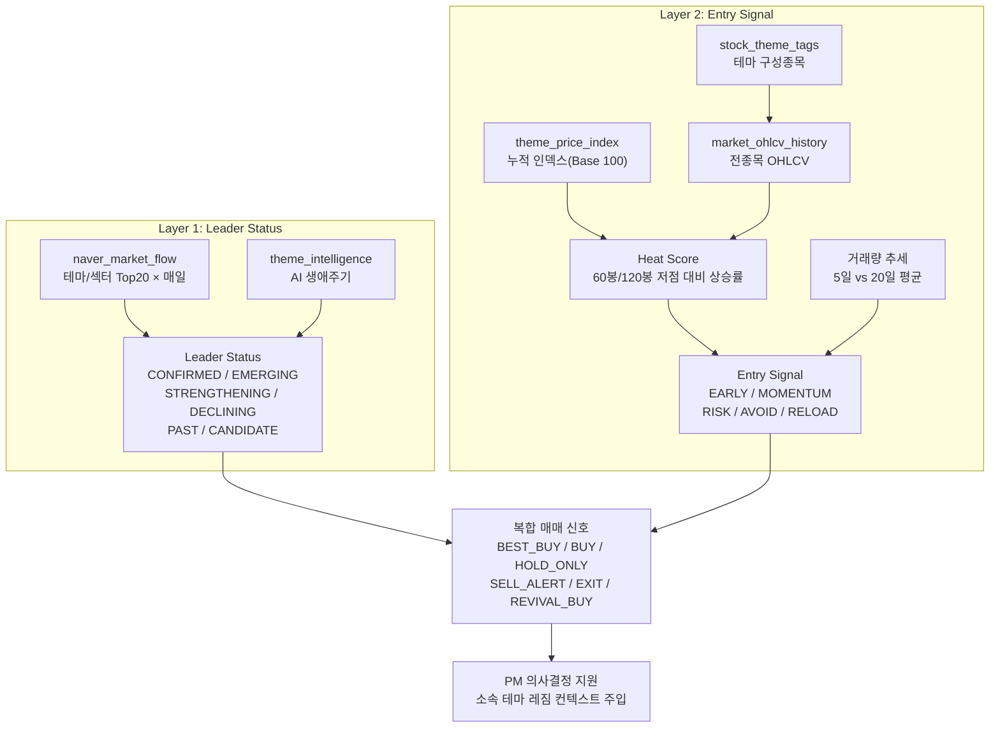

# 🏆 Track A — 대장주/대장섹터 발굴 & 매매 타이밍 시스템 (v4)

> **작성일**: 2026-04-07 (v4 전면 개정 — v3의 뒷북 문제 해결)
> **핵심 변경**:
> 1. 대장 식별(Leader Status)과 매매 타이밍(Entry Signal)을 **완전히 분리된 2-Layer**로 설계
> 2. 연속 N일 확인 방식 → **첫 부각 + 과열도(Heat Score) 조합**으로 선행 탐지
> 3. `theme_price_index` + `market_ohlcv_history` 기반 60봉/120봉 저점 대비 상승률 활용
> 4. **Track A / Track B UI 완전 분리** — 기존 주도주 AI 화면 보존 + 상단 탭 구조로 확장

---

## 🖥️ UI 아키텍처 — `주도주 AI` 탭 구조

> [!IMPORTANT]
> 상단 탭을 통해 Track A 내에서도 `테마/섹터`와 `개별종목`을 분리해서 볼 수 있도록 구성합니다.

```
[사이드바: 주도주 AI 메뉴 클릭]
│
└── MarketLeadersTab (최상위 컨테이너)
    │
    ├── [탭 1: Track A — 대장 테마/섹터] ← (테마 관점)
    │   수급 랭킹(naver_market_flow) + 구성종목 Heat Score 기반 레짐 판별
    │
    ├── [탭 2: Track A — 대장 개별종목] ← (종목 관점)
    │   5대 DB(급등, 수급, 리포트, 테마 소속) 교차 겹침(Multi-hit) 타겟팅
    │
    └── [탭 3: 주도주 (기존 Track B)] ← 현재 화면 그대로 유지 (전종목 Alpha)
```

### Track A 테마 탭 내부 레이아웃 (좌/우 분할)

기존 계획된 레이아웃을 '대장 테마/섹터' 탭으로 사용합니다.

```
┌─────────────────────────────────────────────────────────────────┐
│ [Track A — 대장 테마]  [Track A — 대장 종목]  [주도주(기존 Track B)] │
├────────────────┬────────────────────────────────────────────────┤
│  좌: 레짐 리스트 │  우: 선택 테마/섹터 상세                         │
│  (상태별 목록)  │                                                │
│  [BEST_BUY] ▼  │  - 30일 Regime 타임라인 차트                     │
│  뉴로모픽 반도체 │  - Heat Score 게이지 (구성종목 60봉/120봉 평균)  │
│  🏆 CONFIRMED  │  - vol_ratio 거래량 추세                         │
│  heat=18% 🟢   │  - 구성 대장주 TOP5 (heat_60, vol_ratio)         │
│                │                                                │
│  [BUY] ▼      │                                                │
│  마이크로 LED   │                                                │
│  🚀 EMERGING   │                                                │
│  heat=11% 🟢   │                                                │
│                │                                                │
│  [HOLD_ONLY]▼  │                                                │
│  보안주(물리)   │                                                │
│  📈 CONFIRMED  │                                                │
│  heat=52% 🟡   │                                                │
└────────────────┴────────────────────────────────────────────────┘
```

### Combined Signal 색상 코드

| Signal | 행 배경색 | 뱃지 색 |
|--------|----------|--------|
| 🎯 BEST_BUY | 에메랄드 미약 배경 | 초록 |
| ✅ BUY | 파랑 미약 배경 | 파랑 |
| ⚠️ HOLD_ONLY | 노랑 미약 배경 | 노랑 |
| 🔴 SELL_ALERT | 빨강 미약 배경 | 빨강 |
| 🔴 EXIT | 빨강 강한 배경 | 빨강 강조 |
| 🔄 REVIVAL_BUY | 보라 미약 배경 | 보라 |
| 👀 WATCH | 회색 배경 | 회색 |

---

## 🗄️ DB 분리 정책

> [!IMPORTANT]
> Track A와 Track B는 **DB 테이블을 완전히 분리**하여 관리합니다.
> 서로의 데이터를 직접 참조하지 않으며, 통합 비교 탭에서만 조인합니다.

| 구분 | 테이블 | 담당 서비스 | 비고 |
|------|--------|------------|------|
| **Track A 전용** | `leader_regime_snapshot` | `LeaderRegimeTracker` | 신규 생성 |
| **Track A 전용** | `portfolio_score_history` | `LeaderRegimeTracker` | 신규 생성 |
| **Track A 원본** | `naver_market_flow` | 기존 파이프라인 | 읽기 전용 |
| **Track A 원본** | `theme_price_index` | 기존 파이프라인 | 읽기 전용 |
| **Track A 원본** | `stock_theme_tags` | 기존 파이프라인 | 읽기 전용 |
| **Track A 원본** | `theme_intelligence` | 기존 파이프라인 | 읽기 전용 |
| **Track B 전용** | `market_leader_daily` | `MarketLeaderDiscoveryService` | 향후 신규 |
| **Track B 원본** | `market_ohlcv_history` | 기존 파이프라인 | 읽기 전용 |
| **공유 (읽기만)** | `daily_rising_stocks` | 양쪽 참조 가능 | 쓰기는 파이프라인만 |



---

## 🎯 최종 목표 (불변)

> [!IMPORTANT]
> **이 시스템은 "최적 매매 타이밍 포착"을 위한 전투 정보 시스템입니다.**
>
> - 시장의 **대장주/대장섹터(여러 개)**를 찾아내고
> - 각 항목이 지금 **피크아웃인지 / 라이징인지 / 눌림목 재상승 시작인지** 정확히 파악하여
> - **가장 좋은 지점에 진입**하고 **가장 좋은 지점에 매도**할 수 있는 시스템을 구축합니다.

### 4대 핵심 질문

| # | 질문 | 성격 | 매매 활용 |
|:--:|------|------|----------|
| Q1 | **지금 대장 섹터와 대장주는 무엇인가?** | 현재 상태 포착 | 5대 DB 통합 및 빈도 분석 |
| Q2 | **현재 대장주가 더 상승할 것인가?** | 지속성 판단 | 개별 종목 OHLCV Heat 분석 |
| Q3 | **새롭게 부각 중인 대장주 후보는?** | 신규 진입 탐지 | 교차 등장(예: 급등+리포트) 시작 감지 |
| Q4 | **지나간 대장 중 재상승할 것은?** | 재부각 감지 | 구성종목 Heat 리셋 + 수급 유입 |

---

## 🏗️ [NEW] 5대 AI 데이터 통합 아키텍처 (Unified Discovery)

> **현재의 문제점**: 각 AI 파이프라인(테마, 급등, 수급, 리포트, 이슈)이 각자 DB(`naver_market_flow`, `daily_rising_stocks` 등)를 쌓고 있어서, 전체 시장 관점의 "진짜 대장주"를 뽑아내려면 이 데이터들을 융합해야 합니다. 특히 테마의 과열도(Heat)는 단순히 인덱스로는 부정확하며, **해당 테마를 구성하는 대장 종목들의 실제 OHLCV 데이터 기반으로 산출**해야 합니다.

### 1. 데이터 통합 플로우 (Data Fusion)

대장주/섹터 발굴을 위해 다음 5가지 경로의 데이터를 풀(Pool)로 통합합니다.

1. **테마/섹터 AI (`naver_market_flow` + `stock_theme_tags`)**
   - 시장 주도 테마/섹터 순위 
   - 각 테마에 속한 대표 종목 리스트
2. **급등주 AI (`daily_rising_stocks`)**
   - 당일 상한가/급등 종목 및 엮인 테마/이슈
3. **수급 AI (기관/외국인 연속 매수 종목 + `sector_investor_flow`)**
   - 특정 종목/섹터로의 수급 쏠림 현상
4. **리포트/이슈 AI (`naver_research_flow`, `market_news_consensus`)**
   - 투자의견 상향, 목표가 상향 리포트 발간 종목
   - 시장 컨센서스 집중 종목

### 2. 분리 산출 전략 (Two-Track Approach)

서로 다른 정보를 융합하기 위해 Track A를 **테마(Sector)** 산출과 **종목(Stock)** 산출의 두 파이프라인으로 완전히 분리합니다.

#### 2-A. [Track A — 테마/섹터]: 대장 테마 산출
- `naver_market_flow`의 탑 랭킹 빈도를 통해 시장 수급 파도(Leader Status)를 확정합니다 (Layer 1).
- 확정된 테마가 진짜 진입 가능한 자리인지 확인하기 위해, 해당 테마에 묶인 실제 **종목들의 평균 OHLCV Heat Score**를 구해 Entry Signal을 결정합니다 (Layer 2).
- 👉 최종 산출물: **수급 레짐 스냅샷(`leader_regime_snapshot`에 기록)**

#### 2-B. [Track A — 개별종목]: 대장 종목 산출
- 위 5대 풀에 등장한 모든 종목 코드를 취합하여 **중복 히트(Multi-hit) 점수**를 부여합니다.
  - (1점) `daily_rising_stocks` 오늘의 급등/상한가 포함 여부
  - (1점) `sector_investor_flow` / 기관외인 순매수 연속 유입 여부
  - (1점) `naver_research_flow` 등 리포트 및 목표가 상향 여부
  - (1점) 선별된 대장 테마(Layer 1 상태가 CONFIRMED/EMERGING인 테마) 소속 여부
- 다중 조건을 만족하는 겹침 종목을 추출한 후, 해당 종목의 독자적인 `heat_60`과 `vol_ratio`를 산출합니다.
- 👉 최종 산출물: **다중 교차 검증된 대장주 타겟 리스트 (상위 점수 종목들)**

---

## ⚠️ v3 계획의 근본 문제점과 해결 방향

### 문제: 확인 기반(Confirmation-based) 로직 = 뒷북

| v3의 기준 | 실제 상황 |
|----------|---------|
| "5일 중 4일 이상 Top5 = Crown" | 이미 피크아웃 가능성 높음. 충분히 올라서 Top5를 유지한 것 |
| "3일 연속 순위 하락 = PeakOut" | 가격이 이미 빠진 뒤. 순위 하락 확인 시 매도 타이밍 놓침 |
| "어제 Top20 밖 → 오늘 Top10 = Rising" | 단순 첫 등장이 항상 매수 기회는 아님 — 이미 크게 오른 상태일 수 있음 |

### 핵심 원칙 전환

```
❌ 기존: "N일 연속 확인" → 뒷북
✅ 새 방식: "첫 부각 조짐 + 아직 과열 안 됨" → 선행 포착

핵심 공식:
  대장 후보 판단  =  랭킹 변화 추세  (수급 집중도 — Layer 1)
  매수 타이밍 판단  =  과열도(Heat Score) + 거래량 추세  (Layer 2)
  → 두 레이어는 완전히 독립적으로 계산 후 조합
```

---

## 🏗️ 핵심 설계: 2-Layer 완전 분리

> [!IMPORTANT]
> **대장 식별 로직**과 **매매 타이밍 로직**은 서로 다른 질문에 답합니다.
> 두 레이어를 섞으면 안 됩니다.
>
> - Layer 1: "이게 대장인가?" → 시장 수급 데이터(랭킹)로 판단
> - Layer 2: "지금 사도 되는가?" → 가격 과열도 + 거래량으로 판단



---

## Layer 1: Leader Status — "이게 대장인가?"

### 상태 분류 기준 (연속 아닌 빈도 기반)

| Status | 의미 | 판별 조건 | 핵심 차이 |
|--------|------|----------|---------|
| 🏆 **CONFIRMED** | 확정된 대장 | 최근 10일 중 **6일 이상** Top10 등장 | "연속"이 아닌 "빈도" — 간헐 등락 허용 |
| 🚀 **EMERGING** | 부각 시작 후보 | 최근 3일 중 2일 이상 Top15 + PAST 이력 없음 | 첫 등장 조짐, 빠른 포착 |
| 📈 **STRENGTHENING** | 모멘텀 가속 | EMERGING이면서 최근 5일 avg_rank < 직전 5일 avg_rank | 순위가 계속 개선 중 |
| 📉 **DECLINING** | 약화 중 | CONFIRMED였는데 최근 3일 avg_rank > 직전 3일 avg_rank | 여전히 랭킹권이나 밀리는 중 |
| 💤 **PAST** | 이전 대장 | 과거 CONFIRMED 이력 + 현재 10일간 Top15 등장 < 2회 | 소강 상태의 전 대장 |
| 👀 **CANDIDATE** | 관찰 대상 | Top20 내 1-2회 등장 + CONFIRMED/PAST 이력 없음 | 판단 보류 |

> [!NOTE]
> **왜 "연속"이 아니라 "빈도"인가?**
> 진짜 대장 테마도 매일 쉬지 않고 Top5를 유지하진 않습니다.
> "10일 중 6일 이상 Top10"은 간헐적 조정을 허용하면서도 시장 주도권을 가진 테마를 정확히 식별합니다.
> 5일 연속 기준은 조정 하루면 카운트가 리셋되어 실제 대장을 놓칩니다.

### `theme_intelligence` 생애주기 교차 (강제 조정)

```
Leader Status가 CONFIRMED이더라도:
  lifespan_type = '과열' 또는 '설거지' → DECLINING으로 강제 하향 (AI 우선)
  lifespan_type = '발생' 또는 '성장' → EMERGING/STRENGTHENING 신뢰도 가산
```

---

## Layer 2: Entry Signal — "지금 사도 되는가?"

### 핵심: 과열도(Heat Score) — 구성종목 OHLCV 60봉/120봉 저점 기준 계산

**Leader Status와 완전히 독립적으로** 계산합니다.
"대장 테마/주식이어도 이미 60% 올랐으면 AVOID" — "신규 부각이어도 15%만 올랐으면 EARLY"

#### 2-1. 테마/섹터 과열도 (구성종목 기반 산출)

기존 `theme_price_index`에 의존하면 데이터 지연 및 불일치(999% 오류)가 발생합니다.
따라서, **테마에 속한 핵심 종목(TOP 5)의 OHLCV 데이터로 테마의 Heat를 계산**합니다.

```sql
-- 1. [테마-종목 매핑] stock_theme_tags 에서 테마별 종목 추출
-- 2. [종목 Heat 계산] market_ohlcv_history 에서 각 종목의 60/120봉 저점 대비 오늘 상승률 도출
-- 3. [테마 Heat 집계] 종목들 Heat의 평균(또는 상위 3개 평균)을 테마의 Heat Score로 확정

WITH StockHeat AS (
    SELECT 
        h.stock_cd, 
        h.close_price,
        MIN(h.low_price) OVER (PARTITION BY h.stock_cd ORDER BY h.date ROWS BETWEEN 60 PRECEDING AND CURRENT ROW) as min_60,
        (h.close_price - min_60) / min_60 * 100 as heat_60
    FROM market_ohlcv_history h
)
SELECT 
    t.theme_name,
    AVG(s.heat_60) as theme_heat_60
FROM stock_theme_tags t
JOIN StockHeat s ON t.stock_cd = s.stock_cd
GROUP BY t.theme_name
```

#### 2-2. 개별 대장주 과열도 (직접 매매 타겟팅)

개별 종목(급등, 리포트, 수급, 테마대장주)은 `market_ohlcv_history`에서 직접 아래 값을 뽑습니다:
- **`heat_60d`**: 60일 최저점 대비 % 상승률 
- **`heat_120d`**: 120일 최저점 대비 % 상승률
- **`vol_ratio`**: 최근 5일 평균 거래량 / 20일 평균 거래량 (수급 유입 강도)

```sql
WITH latest AS (
    -- 가장 최근 영업일의 데이터만
    SELECT stock_code, close, trading_value,
           ROW_NUMBER() OVER (PARTITION BY stock_code ORDER BY date DESC) AS rn
    FROM market_ohlcv_history
),
min_60 AS (
    SELECT stock_code,
           MIN(close) AS min_close_60,
           AVG(CASE WHEN date >= date('now', '-5 days', 'localtime')
                    THEN trading_value END) AS avg_vol_5d,
           AVG(CASE WHEN date >= date('now', '-20 days', 'localtime')
                    THEN trading_value END) AS avg_vol_20d
    FROM market_ohlcv_history
    WHERE date >= date('now', '-60 days', 'localtime')
    GROUP BY stock_code
)
SELECT
    l.stock_code,
    ROUND((l.close - m.min_close_60) / m.min_close_60 * 100, 1) AS heat_60,
    ROUND(m.avg_vol_5d / NULLIF(m.avg_vol_20d, 0), 2)            AS vol_ratio
FROM latest l
JOIN min_60 m ON m.stock_code = l.stock_code
JOIN stock_theme_tags stt ON stt.stock_code = l.stock_code
WHERE l.rn = 1 AND stt.tag_name = ?;  -- 특정 테마명
```

> **테마 Heat Score 최종값** = 구성 종목 `heat_60` 평균 + `vol_ratio` 평균

#### 2-3. Heat Score → Entry Zone 분류

| Entry Zone | 테마 heat_60d | 구성종목 avg heat_60 | vol_ratio | 의미 |
|-----------|:----------:|:----------------:|:--------:|------|
| 🟢 **EARLY** | < 20% | < 25% | ≥ 1.0 | **최고 매수 구간** — 이격 여유 충분, 수급 유입 중 |
| 🔵 **MOMENTUM** | 20~40% | 25~50% | ≥ 1.0 | **모멘텀 탑승** — 메인 상승 구간 |
| 🟡 **RISK** | 40~60% | 50~70% | 무관 | **위험 진입** — 단기 트레이더만, 손절 필수 |
| 🔴 **AVOID** | > 60% | > 70% | < 0.8 | **신규 매수 금지** — 익절 검토 구간 |
| 🔄 **RELOAD** | < 20% (리셋) | < 25% (리셋) | 회복 중 | **눌림목 재매수** — PAST 이력 있을 때만 |

> [!TIP]
> **vol_ratio = 최근 5일 평균 거래대금 / 최근 20일 평균 거래대금**
> - ≥ 1.2: 수급 강하게 유입 중
> - 0.8~1.2: 중립
> - < 0.8: 관심 이탈 경고 → heat와 무관하게 AVOID 신호 강화

---

## 복합 매매 신호 — 두 레이어 조합 매핑표

| Leader Status | Entry Zone | 복합 신호 | 행동 지침 |
|:-------------|:----------:|:--------:|---------|
| EMERGING / STRENGTHENING | 🟢 EARLY | 🎯 **BEST_BUY** | 막 부각 + 이격 여유. 최고 타이밍 |
| CONFIRMED | 🟢 EARLY | 🎯 **BEST_BUY** | 대장 확정 + 눌림목. 추가 매수 포함 |
| EMERGING / STRENGTHENING | 🔵 MOMENTUM | ✅ **BUY** | 부각 초기 + 모멘텀 탑승 구간 |
| CONFIRMED | 🔵 MOMENTUM | ✅ **BUY** | 대장 + 메인 상승 구간 |
| CONFIRMED | 🟡 RISK | ⚠️ **HOLD_ONLY** | 대장이지만 과열. 신규 진입 자제 |
| DECLINING | 🟡 RISK | 🔴 **SELL_ALERT** | 약화 중 + 과열. 익절 시점 |
| DECLINING | 🔴 AVOID | 🔴 **EXIT** | 즉시 익절 |
| CONFIRMED | 🔴 AVOID | ⚠️ **PREPARE_EXIT** | 대장이나 극도 과열. 분할 익절 준비 |
| PAST | 🔄 RELOAD | 🔄 **REVIVAL_BUY** | 과거 대장 + Heat 리셋. 눌림목 재매수 |
| CANDIDATE | 🟢 EARLY | 👀 **WATCH** | 아직 대장 미확인. 다음날 재확인 |
| any | 🔴 AVOID (vol↓↓) | 🔴 **EXIT** | 거래량 급감은 Heat 무관 매도 시그널 |

---

## 📋 핵심 데이터 인벤토리

| 테이블 | 레이어 | 일일 레코드 | 활용 목적 |
|--------|--------|:----------:|---------|
| `naver_market_flow` | Layer 1 | ~40건 | 테마/섹터 랭킹 히스토리 |
| `theme_intelligence` | Layer 1 보조 | ~40건 | AI 생애주기 교차 검증 |
| `theme_price_index` | Layer 2 | ~40건 | 테마 Heat Score 계산 |
| `market_ohlcv_history` | Layer 2 | 전종목 | 구성종목 개별 Heat Score |
| `stock_theme_tags` | Layer 2 연결 | 누적 | 테마 → 종목 코드 매핑 |
| `daily_rising_stocks` | Phase 2 | ~30건 | 종목 히트맵 (연속 급등) |
| `naver_research_flow` | Phase 2 | ~20건 | 증권사 선행 지표 |
| `ai_analyst_picks` | Phase 3 | ~100건 | AI 에이전트 합의도 교차 |

---

## Phase 1: 구현 (최우선)

### 신규 테이블: `leader_regime_snapshot`

```sql
CREATE TABLE IF NOT EXISTS leader_regime_snapshot (
    id INTEGER PRIMARY KEY AUTOINCREMENT,
    snapshot_date TEXT NOT NULL,
    type TEXT NOT NULL,                 -- 'THEME' | 'SECTOR'
    name TEXT NOT NULL,

    -- [Layer 1] Leader Status
    leader_status TEXT NOT NULL,        -- 'CONFIRMED'|'EMERGING'|'STRENGTHENING'|'DECLINING'|'PAST'|'CANDIDATE'
    appearances_10d INTEGER DEFAULT 0,  -- 최근 10일 중 Top10 등장 횟수 (연속 아닌 빈도)
    avg_rank_5d REAL,                   -- 최근 5일 평균 순위
    avg_rank_prev5d REAL,               -- 직전 5일 평균 순위 (추세 비교)
    rank_today INTEGER,                 -- 오늘 순위 (NULL = Top20 밖)
    change_rate_today REAL,             -- 오늘 등락률
    lifespan_type TEXT,                 -- theme_intelligence 생애주기
    confirmed_since TEXT,               -- CONFIRMED 최초 진입일

    -- [Layer 2] Entry Signal (과열도)
    heat_score_60d REAL,                -- theme_price_index 기반 60봉 저점 대비 상승률 (%)
    heat_score_120d REAL,               -- theme_price_index 기반 120봉 저점 대비 상승률 (%)
    stock_avg_heat_60 REAL,             -- 구성종목 평균 heat_60 (market_ohlcv_history 기반)
    vol_ratio_5d_20d REAL,              -- 거래량 비율 (최근5일/최근20일)
    entry_zone TEXT NOT NULL,           -- 'EARLY'|'MOMENTUM'|'RISK'|'AVOID'|'RELOAD'

    -- [조합] 복합 매매 신호
    combined_signal TEXT NOT NULL,      -- 'BEST_BUY'|'BUY'|'HOLD_ONLY'|'SELL_ALERT'|'EXIT'|'PREPARE_EXIT'|'REVIVAL_BUY'|'WATCH'
    leading_stocks TEXT,                -- 대장주 TOP5 JSON: [{code, name, heat_60, vol_ratio}]
    ai_summary TEXT,                    -- theme_intelligence AI 근거

    created_at TEXT DEFAULT (datetime('now', 'localtime')),
    UNIQUE(snapshot_date, type, name)
);
```

### 신규 서비스: `LeaderRegimeTracker.ts`

**위치**: `electron/services/v2_pipeline/LeaderRegimeTracker.ts`

```typescript
export class LeaderRegimeTracker {

    /** 메인 진입점 — 매일 15:45 PortfolioJudgeScheduler에서 호출 */
    public async analyzeDailyRegime(today: string): Promise<void> {

        // [Step 1] Layer 1 데이터: naver_market_flow 20일치 히스토리
        const todayFlow   = this.getTodayFlow(today);
        const flowHistory = this.getFlowHistory(today, 20);

        // [Step 2] Layer 2 데이터: 테마 과열도 (theme_price_index)
        const themeHeat = this.calcThemeHeatScores(today);  // {name: {heat_60d, heat_120d}}

    ### Phase 0: UI 탭 구조 분리 (✅ 완료)

- [x] `MarketLeadersTab.tsx` 상단에 탭 3개 추가
  - [x] `activeTrack` state (기본값: `'track-b'` — 기존 화면 유지)
  - [x] **`track-b` 탭**: 기존 코드 그대로 래핑
  - [x] **`track-a` 탭**: `TrackAPanel` 컴포넌트 (Phase 1-C에서 완성)
  - [x] **`compare` 탭**: "준비 중" 메시지 (Phase 3 예정)

### Phase 1-A: Heat Score 계산 인프라 (✅ 완료)
- [x] `DatabaseService.ts`에 `getThemeHeatScores(today: string)` 쿼리 메서드
  - [x] `theme_price_index` self-JOIN으로 60봉/120봉 저점 대비 상승률 계산
- [x] `DatabaseService.ts`에 `getStockHeatByTheme(today: string)` 메서드
  - [x] `stock_theme_tags` → `market_ohlcv_history` 윌도우 함수로 heat_60 + vol_ratio 집계
- [x] IPC 핸들러 등록: `track-a:get-regime-snapshot`, `track-a:get-regime-timeline`, `track-a:run-regime-analysis`

### Phase 1-B: LeaderRegimeTracker 서비스 (✅ 완료)
- [x] `leader_regime_snapshot` + `portfolio_score_history` 테이블 DDL (`DatabaseService.ts`)
  - [x] Track A **전용** 테이블 — Track B 테이블과 완전 분리
- [x] `electron/services/v2_pipeline/LeaderRegimeTracker.ts` 파일 생성
  - [x] `determineLeaderStatus()`: 빈도 기반 Layer 1 (연속 아닌 횟수)
  - [x] `determineEntryZone()`: Heat Score + vol_ratio 기반 Layer 2
  - [x] `combineLayers()`: 매핑 테이블 적용 → combined_signal 산출
  - [x] `analyzeDailyRegime()`: 메인 진입점 (오늘자 전체 테마 처리)
  - [x] `checkRevivalCandidates()`: Top20 밖 PAST 이력 테마 RELOAD 체크
- [ ] `PortfolioJudgeScheduler` 15:45 크론에 `analyzeDailyRegime()` 연동 (Phase 3 시)

### Phase 1-C: Track A 탭 UI 구현 (✅ 완료)
- [x] **좌측 패널**: 레짐 목록 (Combined Signal 필터 + THEME/SECTOR 필터)
  - [x] signal별 색상 행 배경 + 뱃지
  - [x] HeatBar 컴포넌트 (60봉 과열도 시각화)
  - [x] vol_ratio 표시 (수급 유입 강도)
- [x] **우측 패널**: 클릭 시 상세 (Heat Score 3개 게이지 + 30일 타임라인 + AI 요약)
- [x] 수동 레짐 분석 실행 버튼 + 데이터 없음 빈 상태 UI     }
        if (this.hasPastConfirmedHistory(item.name)) return 'PAST';
        return 'CANDIDATE';
    }

    // ─── Layer 2 ───────────────────────────────────────────────────
    private determineEntryZone(
        name: string,
        themeHeat: Record<string, {heat_60d: number, heat_120d: number}>,
        stockHeat: Record<string, {avg_heat_60: number, vol_ratio: number}>
    ): EntryZone {
        const h60       = themeHeat[name]?.heat_60d   ?? 999;  // 데이터 없으면 AVOID
        const sh60      = stockHeat[name]?.avg_heat_60 ?? 999;
        const volRatio  = stockHeat[name]?.vol_ratio   ?? 1.0;

        // 거래량 급감은 과열도 무관하게 위험 신호
        if (volRatio < 0.6) return 'AVOID';

        // PAST 이력 있고 Heat 리셋 → RELOAD(눌림목 재매수)
        if (this.hasPastConfirmedHistory(name) && h60 < 20 && volRatio >= 0.9)
            return 'RELOAD';

        if (h60 < 20  && sh60 < 25  && volRatio >= 1.0) return 'EARLY';
        if (h60 < 40  && sh60 < 50  && volRatio >= 1.0) return 'MOMENTUM';
        if (h60 < 60  && sh60 < 70)                      return 'RISK';
        return 'AVOID';
    }

    // ─── Combine ───────────────────────────────────────────────────
    private combineLayers(status: LeaderStatus, zone: EntryZone): CombinedSignal {
        const map: Partial<Record<`${LeaderStatus}:${EntryZone}`, CombinedSignal>> = {
            'EMERGING:EARLY':       'BEST_BUY',
            'STRENGTHENING:EARLY':  'BEST_BUY',
            'CONFIRMED:EARLY':      'BEST_BUY',
            'EMERGING:MOMENTUM':    'BUY',
            'STRENGTHENING:MOMENTUM': 'BUY',
            'CONFIRMED:MOMENTUM':   'BUY',
            'CONFIRMED:RISK':       'HOLD_ONLY',
            'DECLINING:RISK':       'SELL_ALERT',
            'DECLINING:AVOID':      'EXIT',
            'CONFIRMED:AVOID':      'PREPARE_EXIT',
            'PAST:RELOAD':          'REVIVAL_BUY',
            'CANDIDATE:EARLY':      'WATCH',
        };
        return map[`${status}:${zone}`] ?? 'WATCH';
    }
}
```

---

## Phase 2: 급등주/리포트 타임라인

Phase 1과 독립적으로 구현. 이미 쌓인 데이터를 분석합니다.

### 2-1. 종목 히트맵 (10일간 연속 급등 종목)
```sql
SELECT stock_code, stock_name, theme_sector,
    COUNT(*) as appearance_days,
    AVG(change_rate) as avg_daily_change,
    AVG(trading_value) as avg_trading_value
FROM daily_rising_stocks
WHERE date >= date('now', '-10 days', 'localtime') AND timing = 'EVENING'
GROUP BY stock_code
HAVING COUNT(*) >= 3
ORDER BY appearance_days DESC, avg_daily_change DESC;
```

### 2-2. 증권사 리서치 집중 산업 (기관 관심 선행 지표)
```sql
SELECT industry_name,
    COUNT(*) as report_count,
    COUNT(DISTINCT broker) as broker_count,
    COUNT(DISTINCT date) as active_days
FROM naver_research_flow
WHERE date >= date('now', '-14 days', 'localtime')
GROUP BY industry_name HAVING COUNT(*) >= 3
ORDER BY broker_count DESC, report_count DESC;
```

---

## Phase 3: PM 연동 — LeaderRegime 컨텍스트 주입

PM 종목 평가 시 해당 종목 소속 테마/섹터의 Regime을 프롬프트에 자동 주입합니다.

```typescript
// PM 프롬프트 생성 시 추가 (종목별)
const themeRegime = db.prepare(`
    SELECT leader_status, entry_zone, combined_signal, heat_score_60d, vol_ratio_5d_20d
    FROM leader_regime_snapshot
    WHERE snapshot_date = ? AND name = ? AND type = 'THEME'
`).get(today, stockTheme);

// 프롬프트 예시:
`[테마 레짐 정보 - 종목 평가에 반영하시오]
소속 테마: 뉴로모픽 반도체
  → 대장 상태: CONFIRMED (최근 10일 중 8일 Top10)
  → 과열도(60봉): 18% (EARLY 구간 — 이격 여유 충분)
  → 거래량 추세: 1.4x (5일/20일, 수급 강하게 유입 중)
  → 복합 신호: BEST_BUY 🎯
  → conviction_score +15점 가산 권장

[경고: 아래 테마 소속 종목은 매도 신중]
  → 소속 테마 "CCTV&DVR": DECLINING × AVOID → EXIT 신호
  → 즉시 익절 검토 필요`
```

---

## 🗺️ 구현 로드맵

### Phase 0: UI 탭 구조 분리 (선행 — 다른 모든 작업의 기반)

> 기존 `MarketLeadersTab` 화면을 건드리지 않고 탭 컨테이너만 먼저 씌웁니다.

- [ ] `MarketLeadersTab.tsx` 상단에 탭 3개 추가
  ```tsx
  const TABS = [
    { id: 'track-a', label: 'Track A — 수급 레짐',  icon: Activity },
    { id: 'track-b', label: 'Track B — Alpha 랭킹', icon: TrendingUp },  // 기존 UI
    { id: 'compare', label: '통합 비교',             icon: GitCompare }, // Phase 3 예정
  ]
  ```
- [ ] `activeTrack` state 추가 (기본값: `'track-b'` — 기존 화면 유지)
- [ ] **`track-b` 탭**: 기존 코드 그대로 래핑 (변경 없음)
- [ ] **`track-a` 탭**: 빈 플레이스홀더로 시작, Phase 1-C에서 채움
- [ ] **`compare` 탭**: "준비 중" 메시지 (Phase 3 예정)

### Phase 1-A: Heat Score 계산 인프라 (백엔드)
- [ ] `DatabaseService.ts`에 `getThemeHeatScores(today: string)` 쿼리 메서드
  - `theme_price_index` self-JOIN으로 60봉/120봉 저점 대비 상승률 계산
- [ ] `DatabaseService.ts`에 `getStockHeatByTheme(today: string)` 메서드
  - `stock_theme_tags` → `market_ohlcv_history` 윈도우 함수로 heat_60 + vol_ratio 집계
- [ ] IPC 핸들러 등록: `ipcMain.handle('getThemeHeatScores', ...)`

### Phase 1-B: LeaderRegimeTracker 서비스 (백엔드)
- [ ] `leader_regime_snapshot` 테이블 DDL 생성 (`DatabaseService.ts`)
  - Track A **전용** 테이블 — Track B 테이블과 완전 분리
- [ ] `electron/services/v2_pipeline/LeaderRegimeTracker.ts` 파일 생성
  - [ ] `determineLeaderStatus()`: 빈도 기반 Layer 1 (연속 아닌 횟수)
  - [ ] `determineEntryZone()`: Heat Score + vol_ratio 기반 Layer 2
  - [ ] `combineLayers()`: 매핑 테이블 적용 → combined_signal 산출
  - [ ] `analyzeDailyRegime()`: 메인 진입점 (오늘자 전체 테마 처리)
  - [ ] `checkRevivalCandidates()`: Top20 밖 PAST 이력 테마 RELOAD 체크
- [ ] `PortfolioJudgeScheduler` 15:45 크론에 `analyzeDailyRegime()` 연동
- [ ] IPC 핸들러 등록: `ipcMain.handle('getLeaderRegime', ...)`

### Phase 1-C: Track A 탭 UI 구현
- [ ] **좌측 패널**: 레짐 목록 (Leader Status + Entry Zone 기준 그루핑)
  - Combined Signal별 색상 행 배경
  - 필터 버튼: `[전체] [BEST_BUY] [BUY] [EXIT/SELL]`
  - 각 행: `테마명 | Leader Status 뱃지 | heat_60d 바 | Entry Zone 색상 점 `
- [ ] **우측 패널**: 클릭 시 상세 (선택된 테마/섹터)
  - 30일 Regime 타임라인 미니 차트
  - Heat Score 게이지 (60봉 / 120봉)
  - vol_ratio 트렌드 표시
  - 구성 대장주 TOP5 테이블 (종목명, heat_60, vol_ratio)
  - AI 생애주기 요약 (lifespan_type + reason)
- [ ] 수동 새로고침 버튼 + 마지막 스냅샷 날짜 표시

### Phase 2: 급등주/리포트 타임라인 (★★☆)
- [ ] `getHotStocksTimeline()` 쿼리 메서드 (`DatabaseService.ts`)
- [ ] `getResearchFocusIndustries()` 쿼리 메서드
- [ ] Track A 탭 하단 섹션에 "연속 급등주" + "리서치 집중 산업" 위젯 추가

### Phase 3: PM 연동 + 통합 비교 탭 (★★★)
- [ ] `portfolio_score_history` 테이블 DDL (Track A 전용, theme_regime/sector_regime 필드 포함)
- [ ] PM 프롬프트에 LeaderRegime 컨텍스트 자동 주입 로직
- [ ] conviction_score에 Regime 가중치 반영 (BEST_BUY=+15, BUY=+10, EXIT=-20)
- [ ] `compare` 탭: Track A × Track B 교집합 계산 및 표시
  - Track A `leader_regime_snapshot` × Track B `market_leader_daily` JOIN
  - 양쪽 모두 BEST_BUY/BUY인 종목/테마 = 최고 확신도 하이라이트

---

## 📐 일별 리포트 예시 (15:45 결과)

```
[Leader Regime Report — 2026-04-07]

🎯 BEST_BUY:
  뉴로모픽 반도체 [CONFIRMED × EARLY]
  → 10일 중 8회 Top10, heat_60d=18%(여유↑), vol_ratio=1.4(수급↑)
  → 대장주: 한미반도체(heat_60=21%), 퀀텀코퍼(heat_60=17%)

🎯 BEST_BUY (신규 부각):
  주류업(주정, 에탄올 등) [EMERGING × EARLY]
  → 3일 중 2회 Top15 첫 진입, heat_60d=11%(초기 단계!), vol_ratio=1.3

✅ BUY:
  마이크로 LED [CONFIRMED × MOMENTUM]
  → 10일 중 7회 Top10, heat_60d=32%, vol_ratio=1.2

⚠️ HOLD_ONLY (대장이나 과열):
  보안주(물리) [CONFIRMED × RISK]
  → heat_60d=52%, vol_ratio=0.9(감소 조짐) → 신규 매수 자제

🔴 EXIT:
  CCTV&DVR [DECLINING × AVOID]
  → heat_60d=71%, vol_ratio=0.6(급감), lifespan='설거지'

🔄 REVIVAL_BUY (눌림목):
  건설 [PAST × RELOAD]
  → 3주 전 CONFIRMED → 소강 → heat_60d=17% 리셋, vol_ratio=1.1 회복
```

---

## 🔗 Track A vs Track B 비교 요약

| 구분 | Track A (이 문서) | Track B (별도 계획) |
|------|-----------------|-------------------|
| **판단 기준** | 수급 집중도(랭킹) + 과열도(가격 이격) | 가격 Alpha (전종목 OHLCV 누적 수익률) |
| **데이터 소스** | naver_market_flow, theme_price_index | market_ohlcv_history |
| **탐지 단위** | 테마/섹터 → 구성종목 하향 | 개별종목 → 역산출 테마 상향 |
| **강점** | 수급 이동 조기 포착, 과열 경고 | 가격 모멘텀 실증, 전종목 커버리지 |
| **약점** | 테마 분류 파편화 이슈 | 수급 이동보다 가격이 늦을 수 있음 |
| **전용 DB** | `leader_regime_snapshot` | `market_leader_daily` |
| **UI 탭** | Track A 탭 | Track B 탭 (현재 기존 화면) |
| **교집합 활용** | 통합 비교 탭에서 조인 | ← 동일 |

> [!TIP]
> **두 트랙은 독립적으로 운용되며 서로를 직접 참조하지 않습니다.**
> 최종 교집합 분석은 `통합 비교` 탭에서만 수행합니다.
> - Track A BEST_BUY + Track B Top30 동시 해당 = **최고 확신도**
> - Track A만 BEST_BUY = 수급 선행 신호 (가격 추종 전 단계 가능성)
> - Track B만 Top30 = 이미 가격 오른 종목 (과열도 체크 필요)
