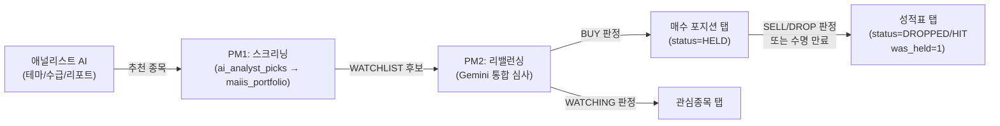
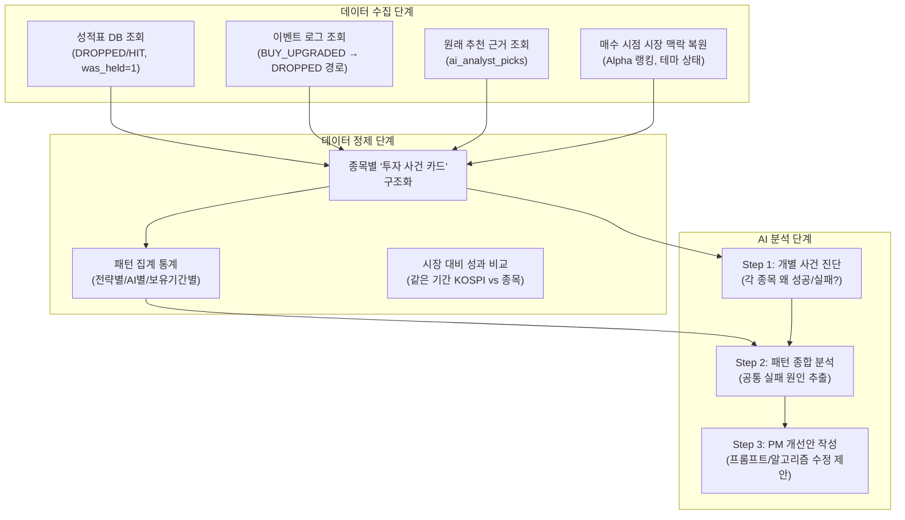
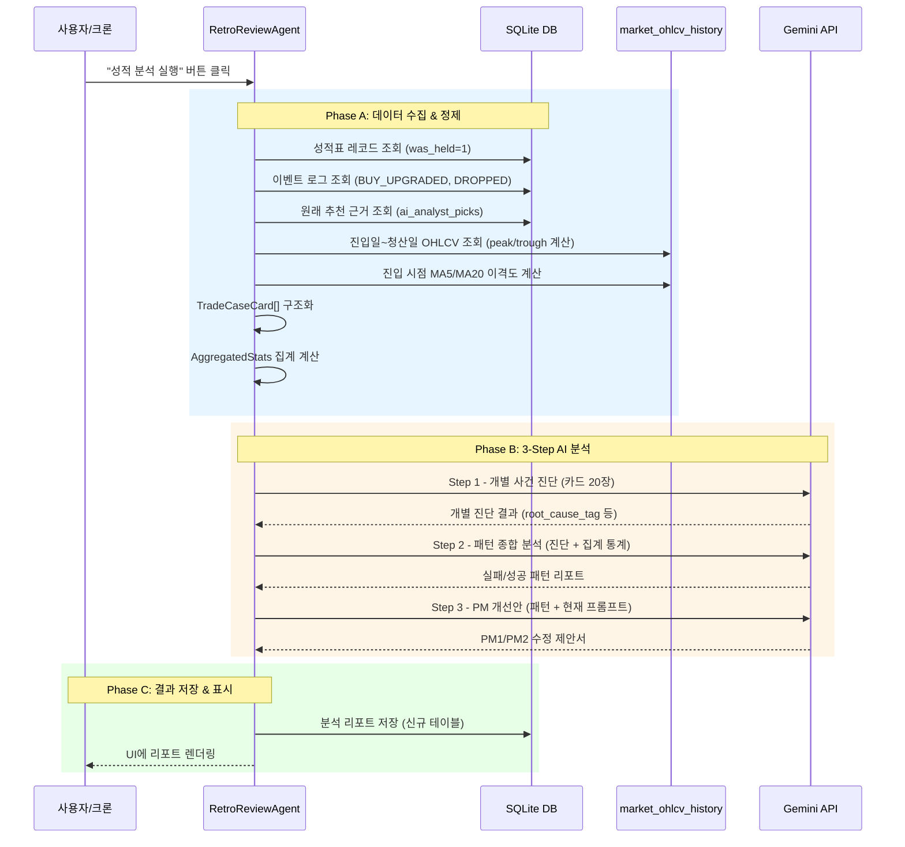

# 🧠 포트폴리오 매니저 성적 분석 & 자동 개선 시스템 기획서

> **작성일**: 2026-04-14  
> **목적**: 성적표(History)에 축적된 매도 완료 종목들의 성공/실패 패턴을 구조화된 데이터로 정리하여 AI에게 넘기고, PM1(스크리닝)·PM2(리밸런싱) 단계의 종목 선별 알고리즘과 프롬프트에 대한 **구체적인 개선 제안서**를 자동 작성하게 하는 시스템.  
> **핵심 원칙**: 코딩 AI(Gemini)가 분석을 수행하되, "쓰레기를 넣으면 쓰레기가 나온다(GIGO)"를 방지하기 위해 **어떤 데이터를 어떤 원칙으로 정리해서 넘길 것인가**에 집중한다.

---

## 1. 현재 시스템 흐름 요약 (AS-IS)



### 현재 저장되는 핵심 데이터

| 데이터 소스 | 테이블 | 주요 컬럼 |
|---|---|---|
| **성적표 레코드** | `maiis_portfolio` (status=DROPPED/HIT, was_held=1) | `stock_code`, `stock_name`, `strategy`, `conviction_score`, `entry_price`, `current_price`, `profit_rate`, `days_held`, `lifespan_days`, `last_signal_reason`, `analysts_json`, `raw_context`, `created_at`, `updated_at` |
| **이벤트 로그** | `maiis_portfolio_events` | `event_type` (BUY_UPGRADED, DROPPED), `old_status`, `new_status`, `price`, `profit_rate`, `reason`, `created_at` |
| **원래 추천 근거** | `ai_analyst_picks` | `agent_type`, `reason`, `confidence`, `entry_price`, `max_profit_rate`, `evaluation_status` |
| **PM2 판단 원문** | `maiis_portfolio.raw_context` | PM2에게 전달했던 팩트시트(차트 다이제스트 + 테마 브리핑 + AI 분석 타임라인) 전문 |
| **PM2 판단 이유** | `maiis_portfolio.last_signal_reason` | PM2가 BUY/WATCHING/SELL을 결정한 한 줄 이유 |

### 현재의 한계점

1. **성적표 데이터가 단순 나열**일 뿐, "왜 실패했는가"에 대한 구조적 분석이 없음
2. 기존 `RetrospectiveAgent`는 **애널리스트(추천 AI)의 추천 정확도**만 채점 → PM의 매수/매도 판단 자체는 회고 대상이 아님
3. PM1/PM2 프롬프트 개선이 사람(개발자)의 수동 직관에 의존

---

## 2. 제안 시스템 개요 (TO-BE)



---

## 3. 데이터 정제 원칙 — "투자 사건 카드(Trade Case Card)" 설계

> **핵심 철학**: AI에게 "생 DB 덤프"를 주지 않는다. 대신, 각 종목의 투자 생애를 **하나의 완결된 사건 카드**로 정리해서 넘긴다. 사건 카드는 인간 트레이더의 매매일지(Trading Journal)와 동일한 구조를 따른다.

### 3-1. 개별 종목 "투자 사건 카드" 스키마

```typescript
interface TradeCaseCard {
    // ── 기본 정보 ──
    stock_code: string;
    stock_name: string;
    strategy: string;              // MOMENTUM | PULLBACK | SWING | VALUE
    
    // ── 투자 판단 경위 (WHY) ──
    original_analysts: string[];   // 최초 추천 AI들 (THEME, MOMENTUM, REPORT)
    original_reasons: string[];    // 각 AI의 추천 사유 원문
    pm2_buy_reason: string;        // PM2가 BUY 판정을 내린 이유 (last_signal_reason at BUY_UPGRADED)
    pm2_conviction_at_buy: number; // 매수 시점의 매력도 점수
    
    // ── 실행 팩트 (WHAT) ──
    entry_date: string;            // 매수일
    entry_price: number;           // 진입가
    exit_date: string;             // 매도/탈락일
    exit_price: number;            // 청산 시점 가격
    holding_days: number;          // 실제 보유 일수
    planned_lifespan: number;      // 계획 보유일 (lifespan_days)
    
    // ── 성과 결과 (RESULT) ──
    final_return_pct: number;      // 최종 수익률 (%)
    peak_return_pct: number;       // 보유 기간 중 최고 수익률 (%)
    trough_return_pct: number;     // 보유 기간 중 최저 수익률 (%)
    exit_reason: string;           // 매도/탈락 사유 (PM2 SELL reason 또는 Cap 초과 등)
    outcome: 'BIG_WIN' | 'SMALL_WIN' | 'BREAKEVEN' | 'SMALL_LOSS' | 'BIG_LOSS';
    
    // ── 시장 맥락 (CONTEXT) ──
    market_alpha_at_entry: number;   // 진입 시점 해당 종목의 10일 알파
    was_in_alpha_top15: boolean;     // 진입일 기준 Alpha Top 15 안에 있었나?
    related_themes: string[];        // 연관 테마/섹터
    theme_was_hot: boolean;          // 테마가 당시 활발한 상태였나?
    
    // ── 차트 맥락 (진입 시점 기술적 조건 복원) ──
    entry_vs_ma5_pct: number;        // 진입가 vs 5일선 이격도 (%)
    entry_vs_ma20_pct: number;       // 진입가 vs 20일선 이격도 (%)
    entry_vs_52w_high_pct: number;   // 진입가 vs 52주 최고가 이격도 (%)
    vol_ratio_at_entry: number;      // 진입일 거래량 비율 (5일평균/20일평균)
}
```

### 3-2. 사건 카드 데이터 수집 방법 (구체적 파이프라인)

| 필드 | 데이터 소스 | 수집 방법 |
|---|---|---|
| `original_analysts`, `original_reasons` | `ai_analyst_picks` | `SELECT agent_type, reason FROM ai_analyst_picks WHERE stock_code = ? AND date <= ? ORDER BY date DESC LIMIT 5` |
| `pm2_buy_reason` | `maiis_portfolio_events` | `SELECT reason FROM maiis_portfolio_events WHERE stock_code = ? AND event_type = 'BUY_UPGRADED' ORDER BY created_at DESC LIMIT 1` |
| `pm2_conviction_at_buy` | `maiis_portfolio_events` | BUY_UPGRADED 이벤트 시점의 `conviction_score` (현재 events 테이블에 미저장 → **스키마 확장 필요**) |
| `peak_return_pct` | `market_ohlcv_history` | 진입일~청산일 사이의 `MAX(high)` 기준 계산 |
| `trough_return_pct` | `market_ohlcv_history` | 진입일~청산일 사이의 `MIN(low)` 기준 계산 |
| `entry_vs_ma5/20_pct` | `market_ohlcv_history` | 진입일 기준 5/20일 이동평균 역산 |
| `was_in_alpha_top15` | `CrossPeriodAnalyzer` 재실행 or 캐시 | 진입일 기준 Alpha 랭킹 스냅샷 (현재 미저장 → **스냅샷 저장 고려**) |
| `vol_ratio_at_entry` | `market_ohlcv_history` | 진입일 기준 5일/20일 평균 거래대금 비율 계산 |

> **현재 미저장이지만 분석에 필수적인 데이터 2건**:
> 1. `BUY_UPGRADED` 이벤트 시점의 `conviction_score` → `maiis_portfolio_events` 테이블에 컬럼 추가 권장
> 2. 일별 Alpha 랭킹 스냅샷 → 별도 테이블 또는 `maiis_portfolio_daily`에 부착 권장
>
> 다만 이 2건이 없어도 1차 분석은 가능합니다. `peak/trough_return`과 `ma_이격도` 같은 핵심 지표는 `market_ohlcv_history`에서 100% 역산 가능합니다.

### 3-3. 성과 분류(Outcome) 기준

| 분류 | 조건 | 의미 |
|---|---|---|
| `BIG_WIN` | `peak_return_pct >= 20%` | 대장주 대박 — 시스템이 의도한 이상적 시나리오 |
| `SMALL_WIN` | `5% <= peak_return_pct < 20%` | 괜찮은 수익 — 타점은 맞았으나 극상이 아님 |
| `BREAKEVEN` | `final_return_pct` 가 -2% ~ +5% 사이 | 본전 — 재료는 있었으나 모멘텀 부족 |
| `SMALL_LOSS` | `-10% <= final_return_pct < -2%` | 소폭 손실 — 타이밍 미스 또는 조정 피격 |
| `BIG_LOSS` | `final_return_pct < -10%` | 심각한 오판 — 근본적 판단 오류 의심 |

---

## 4. 패턴 집계 통계 블록

사건 카드들을 축적한 뒤, AI에게 넘기기 전에 **시스템 코드가 자동으로 계산**해야 하는 집계 통계입니다. (AI가 스스로 세면 할루시네이션 위험)

```typescript
interface AggregatedStats {
    // ── 전체 요약 ──
    total_trades: number;
    win_rate: number;              // (BIG_WIN + SMALL_WIN) / total
    avg_return: number;            // 전체 평균 수익률
    avg_holding_days: number;      // 평균 보유일수
    avg_peak_return: number;       // 평균 최고 수익률 (타점 정확도 지표)
    
    // ── 전략별 성적표 ──
    by_strategy: Record<string, {
        count: number;
        win_rate: number;
        avg_return: number;
        best_trade: string;        // 최고 수익률 종목명
        worst_trade: string;       // 최저 수익률 종목명
    }>;
    
    // ── 추천 AI별 성적표 ──
    by_analyst: Record<string, {
        count: number;
        win_rate: number;
        avg_return: number;
        avg_confidence: number;    // 추천 시점 평균 confidence
    }>;
    
    // ── 보유기간 vs 수익 상관관계 ──
    early_exit_stats: {            // 계획 보유일 50% 미만 시점에 매도된 종목
        count: number;
        avg_return: number;
    };
    full_term_stats: {             // 계획 보유일 80% 이상 보유한 종목
        count: number;
        avg_return: number;
    };
    
    // ── 기술적 진입 조건 vs 결과 상관관계 ──
    high_disparity_entries: {      // 5일선 대비 5% 이상 이격 상태에서 진입
        count: number;
        avg_return: number;
        win_rate: number;
    };
    low_disparity_entries: {       // 5일선 대비 2% 이내 밀착 상태에서 진입
        count: number;
        avg_return: number;
        win_rate: number;
    };
    
    // ── "고점은 찍었지만 팔지 못한" 종목 분석 ──
    missed_profit_trades: {        // peak >= +10% 이었는데 final이 마이너스인 종목
        count: number;
        avg_peak: number;
        avg_final: number;
        examples: string[];        // 종목명 나열
    };
}
```

---

## 5. AI 프롬프트 설계 — 3-Step 분석

### Step 1: 개별 사건 진단 (Per-Trade Diagnosis)

**투입 데이터**: 사건 카드 원문 (최대 20개)  
**목적**: 각 종목의 성공/실패 원인을 1~2줄로 진단

```
[System Prompt]
너는 헤지펀드의 '트레이딩 감사관(Post-Trade Auditor)'이다.
아래에 우리 AI 포트폴리오 매니저가 실제 매수→매도까지 완료한 종목들의 '투자 사건 카드'가 제공된다.

각 사건 카드를 읽고 다음을 판단하라:
1. 이 종목을 매수한 판단은 옳았는가? (진입 타점)
2. 매도 시점은 적절했는가? (익절/손절 타이밍)
3. 한 줄 진단: "이 매매에서 무엇이 잘되었고 / 무엇이 잘못되었는가"

[응답 형식]
{
    "diagnoses": [
        {
            "stock_name": "종목명",
            "entry_quality": "GOOD | FAIR | POOR",
            "exit_quality": "GOOD | FAIR | POOR", 
            "one_line": "5일선 밀착 저점 진입은 우수했으나, +15% 고점에서 이탈 후 4일간 방치하여 수익 반납",
            "root_cause_tag": "LATE_EXIT | CHASING_HIGH | THEME_EXHAUSTED | WRONG_THESIS | MARKET_SHOCK | PERFECT_TRADE"
        }
    ]
}
```

### Step 2: 패턴 종합 분석 (Cross-Trade Pattern Analysis)

**투입 데이터**: Step 1 진단 결과 + 집계 통계 블록  
**목적**: 반복되는 실패 패턴과 성공 패턴 추출

```
[System Prompt]
너는 퀀트 전략 리서치 디렉터이다.
아래에 1) 최근 N건 매매의 개별 진단 결과, 2) 전략별/AI별 집계 통계가 제공된다.

다음을 분석하라:
1. [반복 실패 패턴] 동일한 root_cause_tag가 3건 이상 반복되는 패턴이 있는가?
2. [전략별 심층 분석] MOMENTUM vs SWING 등 전략 간 성과 격차의 원인은?
3. [AI별 기여도] THEME AI vs MOMENTUM AI 중 누가 더 정확한 종목을 공급하는가?
4. ["고점 놓침" 문제] peak_return은 높은데 final_return이 낮은 패턴이 구조적인가?
5. [이격도와 손실] 과열 상태(5일선 대비 5%+)에서 진입한 종목의 승률이 유의하게 낮은가?

[응답 형식]
{
    "failure_patterns": [
        {
            "pattern_name": "고점 추격 매수 후 하락 피격",
            "frequency": "12건 중 5건 (42%)",
            "description": "5일선 대비 이격도가 7% 이상인 상태에서 BUY 판정이 났고, 이 중 80%가 SMALL_LOSS 이하",
            "severity": "HIGH"
        }
    ],
    "success_patterns": [...],
    "strategy_assessment": {...},
    "analyst_ranking": {...}
}
```

### Step 3: PM 개선안 작성 (Actionable Improvement Report)

**투입 데이터**: Step 2 분석 결과 + 현재 PM1/PM2 프롬프트 원문  
**목적**: PM1 알고리즘 및 PM2 프롬프트에 대한 **구체적 수정 제안**

```
[System Prompt]
너는 AI 트레이딩 시스템 아키텍트이다.
아래에 1) 패턴 분석 결과, 2) 현재 PM1(알고리즘 스크리닝)의 코드 로직 요약,
3) 현재 PM2(Gemini 통합 심사)의 시스템 프롬프트 전문이 제공된다.

다음 형식으로 구체적인 개선 제안을 작성하라:

[응답 형식]
{
    "pm1_improvements": [
        {
            "target": "PM1 - 하드 필터링 단계",
            "current_behavior": "confidence 기준 정렬 후 상위 10개 통과",
            "problem": "과열 상태(이격도 7%+) 종목이 필터 없이 PM2로 넘어감",
            "proposed_change": "Phase1에서 5일선 대비 이격도 7% 초과 종목에 대해 confidence를 50% 감점하는 페널티 로직 추가",
            "expected_impact": "고점 추격 매수 건수 42% → 15% 이하로 감소 예상",
            "priority": "HIGH"
        }
    ],
    "pm2_prompt_improvements": [
        {
            "target": "PM2 - 시스템 프롬프트 '매수 판단 이원화 원칙' 섹션",
            "current_text": "[매수(HELD) 포지션 엄격 분리] 지금 당장 실제 현금으로 매수할 만한...",
            "problem": "이격도나 과열도에 대한 구체적 수치 기준이 없어 AI가 주관적으로 판단",
            "proposed_addition": "추가 조건: '5일선 대비 이격도가 8% 이상인 종목은 아무리 재료가 강해도 BUY 판정을 내리지 말고 WATCHING으로 분류하여 눌림목을 대기할 것'",
            "priority": "HIGH"
        }
    ],
    "sell_logic_improvements": [
        {
            "problem": "보유 기간 중 +15% 이상 수익이 발생했음에도 자동 익절 로직이 없어 수익 반납",
            "proposed_change": "PM2 리밸런싱 시 '보유 기간 중 최고 수익률이 +15%를 찍은 종목이 현재 +5% 이하로 하락한 경우, 반강제 SELL 신호를 제안하라'를 프롬프트에 추가",
            "priority": "MEDIUM"
        }
    ]
}
```

---

## 6. 실행 흐름 요약



---

## 7. 구현 범위 & 파일 영향도

### 신규 파일
| 파일 | 역할 |
|---|---|
| `electron/services/v2_agents/PortfolioRetrospectiveAgent.ts` | 핵심 로직 — 데이터 수집, 카드 구조화, 집계, 3-Step AI 호출 |

### 기존 파일 수정
| 파일 | 변경 내용 |
|---|---|
| `electron/services/DatabaseService.ts` | ① `maiis_portfolio_events`에 `conviction_score` 컬럼 추가 (선택) ② 분석 리포트 저장용 신규 테이블 `portfolio_retrospective_reports` 생성 ③ `logPortfolioEvent()`에 conviction_score 인자 추가 |
| `electron/main.ts` | IPC 핸들러 등록: `portfolio:run-retrospective-review` |
| `electron/preload.ts` | API 노출: `runPortfolioRetrospectiveReview()` |
| `src/components/v2_dashboard/PortfolioManagerTab.tsx` | 성적표(History) 탭에 "📊 성적 분석 & 개선안" 버튼 및 결과 렌더링 UI 추가 |

### 신규 DB 테이블

```sql
CREATE TABLE IF NOT EXISTS portfolio_retrospective_reports (
    id INTEGER PRIMARY KEY AUTOINCREMENT,
    date TEXT NOT NULL,
    total_trades INTEGER,
    win_rate REAL,
    avg_return REAL,
    
    -- Step 1 결과
    diagnoses_json TEXT,        -- TradeDiagnosis[] JSON
    
    -- Step 2 결과  
    failure_patterns_json TEXT, -- FailurePattern[] JSON
    success_patterns_json TEXT,
    
    -- Step 3 결과
    pm1_improvements_json TEXT, -- PM1Improvement[] JSON
    pm2_improvements_json TEXT, -- PM2Improvement[] JSON
    sell_improvements_json TEXT,
    
    -- 원본
    raw_ai_response TEXT,
    created_at TEXT NOT NULL
);
```

---

## 8. 실행 조건 & 제약사항

1. **최소 분석 건수**: 성적표에 최소 **5건 이상**의 매매 완료 데이터가 쌓여야 의미 있는 분석이 가능. 5건 미만 시 "아직 데이터가 부족합니다" 경고 후 중단.
2. **분석 주기**: 수동 실행 버튼 기반. 향후 10건 이상 쌓일 때마다 자동 실행 크론 추가 가능.
3. **AI 비용**: Step 1~3 총 3회 Gemini 호출. 종목 수가 20건을 초과하면 Step 1을 2배치로 분할.
4. **프롬프트 자동 적용 여부**: 개선안은 **제안(Suggestion)** 형태로만 표시. 실제 PM 프롬프트 수정은 개발자(사용자)의 수동 승인 후 적용.

---

## 9. UI 출력 설계 (참고)

성적표 탭 상단에 다음과 같은 섹션이 추가됩니다:

```
┌─────────────────────────────────────────────────┐
│ 📊 AI 매매 성적 분석 리포트         [분석 실행]  │
├─────────────────────────────────────────────────┤
│ 📈 전체 승률: 42% (5승 7패)  평균 수익률: -2.3% │
│                                                 │
│ 🚨 주요 실패 패턴 (2건 발견)                     │
│ ┌───────────────────────────────────────────┐   │
│ │ ① 고점 추격 매수 (5건/12건, 심각도: HIGH) │   │
│ │ → 5일선 대비 이격 7%+ 진입, 80% 손실      │   │
│ │                                           │   │
│ │ ② 익절 타이밍 놓침 (3건, 심각도: MEDIUM)   │   │
│ │ → +15% 고점 후 방치, 평균 수익 반납 12%p  │   │
│ └───────────────────────────────────────────┘   │
│                                                 │
│ 💡 PM 개선 제안 (3건)                            │
│ ┌───────────────────────────────────────────┐   │
│ │ [PM1] 이격도 7%+ 종목 confidence 감점     │   │
│ │ [PM2] 프롬프트에 이격도 수치 기준 명시     │   │
│ │ [매도] +15% 후 하락 시 반강제 SELL 추가    │   │
│ └───────────────────────────────────────────┘   │
└─────────────────────────────────────────────────┘
```

---

## 10. 핵심 정리 — AI에게 "좋은 질문"을 하기 위한 데이터 3원칙

| 원칙 | 설명 |
|---|---|
| **① 팩트와 판단을 분리하라** | "진입가 10,000원, 최종 수익률 -5%"는 **팩트**. "고점 추격이었다"는 **판단**. 팩트는 코드가 계산하고, 판단은 AI가 수행한다. AI에게 팩트를 넘기고 판단을 요청해야지, 이미 판단된 결론을 넘기면 AI가 앵무새가 된다. |
| **② 비교군을 제공하라** | "수익률 -5%"만 넘기면 AI는 맥락을 모른다. "같은 기간 KOSPI가 -8%였으므로 시장 대비 +3%p 알파"라는 비교군이 있어야 정확한 진단이 가능하다. 집계 통계의 `market_alpha_at_entry`가 이 역할을 한다. |
| **③ AI가 세지 않게 하라** | "20건 중 MOMENTUM 전략이 몇 건이고 승률이 몇 %인지 계산해줘"를 AI에게 시키면 할루시네이션이 발생한다. 집계 통계는 반드시 코드가 미리 계산해서 숫자로 넘기고, AI에게는 "이 숫자를 보고 해석해줘"만 요청한다. |
