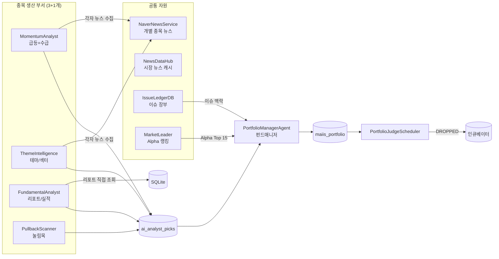
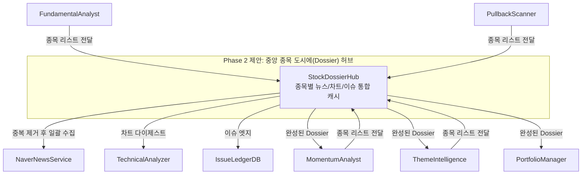

# 🧭 Kiwoom 에이전틱 트레이딩 — Phase 2 전략 의견서

> **날짜**: 2026-04-06  
> **대상**: 현재 v2_agents / v2_pipeline 아키텍처 전체  
> **범위**: 코딩 없음. 아키텍처 개선 방향 및 전략적 의견만 제시.

---

## 0. 현재 시스템 정밀 진단 (As-Is)

### 에이전트 인벤토리 (19개 모듈)

| 역할 | 모듈 | 출력 | 비고 |
|------|------|------|------|
| 🏛️ 시황 마스터 | `MarketConditionAgent` | 장전/장후 LONG/SHORT/HOLD | Cycle A/B/P, 이슈 장부 자동 관리 |
| 🐝 장중 군집 | `IntradaySwarmAgent` | 8인 페르소나 가중투표 | CCI 트리거 + 30분 슬롯 |
| 📊 모멘텀 | `MomentumAnalystAgent` | `ai_analyst_picks` (MOMENTUM) | 거래대금+급등 Top30, 네이버 뉴스 |
| 🔬 테마/섹터 | `ThemeIntelligenceAgent` | `theme_intelligence` + picks (THEME) | S/A/B 등급, 생애주기 분석 |
| 📉 눌림목 | `PullbackScannerAgent` | picks (PULLBACK) | Alpha Top30 → 차트 필터 |
| 📋 리포트 | `FundamentalAnalystAgent` | picks (REPORT) | 증권사 리서치 + 실적 뉴스 |
| 🧑‍💼 포폴 매니저 | `PortfolioManagerAgent` | `maiis_portfolio` | 3부서 picks 통합 평가 |
| ⚖️ 장마감 채점 | `PortfolioJudgeScheduler` | HIT/DROPPED 갱신 | 수익률 + 수명 체크 |
| 🧪 인큐베이터 | `IncubatorScanEngine` + `ValueIncubatorAgent` | 강등→감시→재점화 | DROPPED 자동 이관 |
| 🗺️ 주도주 발굴 | `MarketLeaderDiscoveryService` | Alpha 랭킹 + Reverse Theme | 10일 OHLCV 기반 |
| 📰 이슈 관리 | `IssueManagementAgent` + `IssueLedgerDB` | 이슈 장부, Knowledge Graph | 엣지/타임라인 |
| 🔄 회고 | `MarketReviewAgent` + `RetrospectiveAgent` | 일/주/월 회고 | 피드백 루프 |
| 🤖 코파일럿 | `CoPilotAgent` | 대화형 분석 | - |
| 📈 기술분석 | `TechnicalAnalyzer` | Digest(일봉/5분봉) | CCI, MA, 이격도 |
| 🏷️ 테마 온톨로지 | `ThemeOntologyAgent` | 파편 태그→대분류 매핑 | - |
| 📊 성과 추적 | `PerformanceTracker` | 페르소나 가중치 | 적중률 기반 Hot Hand |

### 현재 데이터 플로우 (종목 추천 → 포폴 평가)



---

## 1. 🎯 종목추천 유기성 강화 — 중복 뉴스/리서치 중앙화

### 현재 갭 (Gap)

코드를 보면 **종목별 뉴스 수집이 에이전트마다 독립적으로 중복 실행**되고 있습니다:

- `MomentumAnalystAgent.runAnalysis()` → 종목 30개 × 네이버 뉴스 10건씩 직접 검색 (L126~L172)
- `ThemeIntelligenceAgent.runBatchAnalysis()` → 주도주별 네이버 타겟 뉴스 직접 검색 (L140~L169)  
- `PortfolioManagerAgent.runDailyReview()` → 테마/섹터/이슈 맥락만 가져옴 (뉴스 없음)

**동일한 종목이 모멘텀 + 테마에서 중복 추천될 때, 같은 뉴스를 2번 수집하고 2번 AI에 보내고 있습니다.**

### 제안: `StockDossierHub` 중앙 캐시 도입



**핵심 설계 원칙:**

1. **종목코드 기반 싱글톤 캐시**: `StockDossierHub.getDossier(stockCode)` — 해당 종목의 뉴스/차트/이슈 맥락이 이미 수집되었으면 캐시 반환 (TTL 30분)
2. **배치 프리페치**: 모멘텀이 먼저 돌면 30종목 Dossier를 미리 구축. 이후 테마/눌림목이 실행될 때 중복 종목은 즉시 캐시 히트
3. **포폴 매니저에도 동일 Dossier 공급**: 현재 PM이 종목별로 `analyzer.generateStockDigest()`를 직접 호출하고 있는데(L168), 이것도 Hub를 타면 중복 API 호출 원천 차단

**예상 효과:**
- 네이버 뉴스 API 호출량 **40~60% 절감**
- 키움 차트 API 호출량 **30% 절감** (PM이 차트를 또 구하므로)
- 동일 종목에 대한 정보 일관성 보장 (같은 뉴스 → 같은 판단 근거)

---

## 2. 포트폴리오 매니저 수익기준 3-Track 체계 재검토

### 현재 갭 (Gap)

현재 `PortfolioJudgeScheduler` (L92~L98)의 수익 판정 로직:

```
if (highProfitPct >= 15.0 || closeProfitPct >= 10.0) → HIT
if (daysHeld >= lifespan_days || 20) → DROPPED
```

**이것은 전략 구분 없이 단일 기준입니다.** `PortfolioManagerAgent`의 시스템 프롬프트(L328~L332)에는 MOMENTUM/PULLBACK/SWING/VALUE 4가지 전략별 판단 기준이 이미 텍스트로 정의되어 있지만, **실제 코드 레벨의 수익/손절 판정은 전략을 무시하고 일괄 적용** 중입니다.

### 사용자가 원하는 3-Track 체계 vs 현재

| Track | 사용자 기대 기준 | 현재(JudgeScheduler) 실제 기준 | 갭 |
|-------|-----------------|-------------------------------|-----|
| **단기** (5일) | +10~15% 목표 | 고가 15% or 종가 10% | ⚠️ 수명(lifespan) 미분화 |
| **스윙** (20봉) | +20~30% 목표, "좋은 가격" 대기 | 동일 기준 일괄 적용 | ❌ |
| **장기** (60봉) | +30~40% 목표, 확실한 실적 기반 | 동일 기준 일괄 적용 | ❌ |

### 제안: Strategy-Aware Judge 로직 (✅ 완료)

> [!NOTE]
> 2026-04-06 업데이트: 해당 로직은 `PortfolioJudgeScheduler.ts`의 `judgeByStrategy()`를 통해 전략별 기준(MOMENTUM/PULLBACK/SWING/VALUE)으로 채점되도록 성공적으로 마이그레이션이 완료되었습니다.

> [!IMPORTANT]
> `PortfolioJudgeScheduler.runDailyJudgement()`에서 `stock.strategy` 필드를 읽어 분기 처리해야 합니다.

```
strategy별 HIT/DROPPED 기준표 (제안):

MOMENTUM (단기):
  - HIT: 고가 +13% 이상 OR 종가 +10% 이상 → 5영업일 이내
  - DROPPED: 수명 5일 초과 AND 종가 -5% 이하
  - 손절: 종가 -8% 이하 즉시 DROPPED

PULLBACK (스윙):  
  - HIT: 고가 +18% 이상 OR 종가 +15% 이상 → 10영업일 이내
  - DROPPED: 수명 15일 초과 AND MA20 이탈
  - 손절: 종가 진입가 대비 -10% 즉시 DROPPED

SWING (중기):
  - HIT: 고가 +25% 이상 OR 종가 +20% 이상 → 20영업일 이내
  - DROPPED: 수명 25일 초과 AND 이슈 소멸
  - 손절: 종가 -12% + 이슈 피해섹터 해당 시 DROPPED

VALUE (장기):
  - HIT: 고가 +35% 이상 OR 종가 +30% 이상 → 60영업일 이내
  - DROPPED: 펀더멘탈 훼손(적자전환 등) AI 판단에 의한 DROP만
  - 손절: 종가 -15% (가장 넓은 허용범위)
```

또한 사용자의 핵심 포인트였던:

- **"지금 당장 사는게 좋을지"** → PM 출력의 `last_signal`이 `IMMEDIATE_BUY`
- **"좋은 가격을 기다리기"** → `WAIT_DIP` 신호 + 목표진입가(target_entry_price) 필드 추가 필요
- **"장기로 보고 진입 대기"** → `WAIT_DIP` + strategy `VALUE`

> [!TIP]
> 현재 PM 프롬프트의 `last_signal`에 이미 `IMMEDIATE_BUY`, `WAIT_DIP` 옵션이 있으므로, **Judge가 이것을 해석하여 "WAIT_DIP 상태의 종목은 목표가 도달 시에만 WATCHLIST→ACTIVE 전환"하는 로직**이 추가되면 됩니다.

---

## 3. 🏆 대장주/주도섹터 판별 엔진 (LeaderRegime)

### 현재 갭 (Gap)

`MarketLeaderDiscoveryService`는 **기계적 Alpha 랭킹**만 산출합니다. 사용자가 원하는 것:

1. **"대장주는 누구인가"** — Alpha만으로는 부족. 시가총액, 거래대금 지속성, 섹터 내 상대강도가 필요
2. **"대장주는 잘 안 바뀌고 장기로 간다"** — 연속 N일 Alpha Top 유지 여부 추적
3. **"대장주 피크아웃인가 지속되는가"** — 테마 생애주기와 교차 분석 필요
4. **"다음 대장주와 섹터는 무엇인지 탐색"** — Alpha 급상승 종목(신규 진입자) 감지
5. **"여러 대장주가 순환매로 돌아가는"** — 동일 섹터 내 대장 교체 패턴 인식
6. **"과거의 주도주가 다시 돌아오는가"** — 이전 대장주의 Alpha 재부상 감지

### 제안: `LeaderRegimeTracker` 신규 모듈

```mermaid
graph TD
    subgraph "LeaderRegimeTracker"
        LD[일일 Alpha 스냅샷<br/>market_leader_daily]
        
        subgraph "파생 분석"
            CR[Crown 연속일 추적<br/>"연속 Top10 = 대장 확정"]
            PO[PeakOut 감지<br/>"Alpha 하락 전환 + 거래량 급증"]
            NE[NextLeader 탐지<br/>"Alpha 급상승 신규 진입자"]
            RT[Rotation 패턴<br/>"동일 섹터 내 대장 교체"]
            RV[Revival 감지<br/>"과거 대장 Alpha 재부상"]
        end
    end

    ML[MarketLeaderDiscovery] -->|Alpha 랭킹| LD
    TI[ThemeIntelligence] -->|생애주기| PO
    LD --> CR --> PM[PortfolioManager]
    LD --> PO --> PM
    LD --> NE --> PM
    LD --> RT --> PM
    LD --> RV --> PM
```

**구현 접근:**

1. **`market_leader_daily` 테이블**: 매일 Alpha Top 30을 스냅샷으로 저장 (현재는 런타임 계산만)
2. **Crown 점수**: 연속 Top 10 진입일 수. 5일 연속 = "준대장", 10일+ = "대장 확정"
3. **PeakOut 시그널**: Alpha 3일 연속 하락 + 당일 대량 양봉(차익실현?)
4. **NextLeader**: 어제 없었는데 오늘 Top 15 신규 진입 + 거래대금 폭증
5. **Rotation**: 같은 테마 내 A종목 Alpha↓, B종목 Alpha↑ = 순환매
6. **Revival**: Alpha Top 50 밖으로 나갔다가 10일 이내 재진입

> [!IMPORTANT]
> 사용자가 언급한 **"종목 메뉴와 주도주 메뉴에서 각각 추출해서 비교"**는 현재 `ThemeIntelligenceAgent`의 stock_picks(테마 기반)와 `MarketLeaderDiscoveryService`의 Alpha 기반 랭킹을 **교차 테이블로 UI에 렌더링**하는 것으로 충분히 시작할 수 있습니다.

---

## 4. 시황AI 역할 축소 & 로컬 스웜 자율화

### 현재 갭 (Gap)

현재 시황 판단 체계:
- **Gemini 기반**: `MarketConditionAgent` Cycle A/B/P — 거시 데이터 + 이슈 장부 + 뉴스 풀 컨텍스트 → Gemini 판단
- **로컬 스웜**: `IntradaySwarmAgent` 8인 페르소나 — 차트 다이제스트만 보고 로컬 LLM 투표

사용자 의도: **"시황의 역할을 줄이고 로컬 스웜에 맡겨보는 구조"**

### 제안: Tiered Autonomy (계층별 자율성)

```
[Tier 1] 로컬 스웜 자율 판단 (비용 0원, 반응 즉시)
├── CCI 트리거 기반 상시 모니터링 (현재 구현됨)
├── 차트 + 수급 데이터만으로 UP/DOWN/HOLD (현재 구현됨)  
├── ✨ NEW: 포폴 긴급 셧다운 시그널 발행 권한
│     → 군집 8인 중 6인 이상 DOWN 투표 + 신뢰도 80%+ 
│        → EventBus.emit('PORTFOLIO_EMERGENCY_HALT')
└── ✨ NEW: 바닥 포착 시 빠른 진입 시그널
      → 과매도 CCI < -200 → 반등 CCI > -100 전환 시
         → EventBus.emit('PORTFOLIO_BOTTOM_SIGNAL')

[Tier 2] Gemini 마스터 AI (하루 2~3회만, 토큰 효율)
├── Cycle A (08:50): 거시 맥락 + 이슈 장부 갱신 (유지)
├── Cycle B (15:10): 장마감 결산 + 오답노트 (유지)
└── ✨ NEW: Cycle A에서 "오늘의 방어 임계값" 설정
      → risk_score 기반으로 로컬 스웜의 셧다운 기준 동적 조정
      → risk_score 80+ → 스웜 4인만 DOWN이어도 셧다운 발동

[Tier 3] 포폴 매니저 리스크 관리 (시황 연동)
├── ✨ NEW: EMERGENCY_HALT 수신 시 → 전종목 HOLD 전환 (매수 금지)
├── ✨ NEW: BOTTOM_SIGNAL 수신 시 → WAIT_DIP 종목 중 조건 충족 건 → ACTIVE 전환
└── 시황AI 판단과 별개로, 로컬 스웜이 직접 포폴 보호 가능
```

**핵심 철학**: 
- **Gemini(비용 큼) = 거시 판단 + 임계값 설정 + 이슈 관리** (하루 2~3회)
- **로컬 스웜(비용 0) = 실시간 미시 판단 + 포폴 보호 트리거** (장중 상시)
- 시황AI가 아침에 "오늘 위험도 85점"이라고 설정하면, 로컬 스웜이 장중 내내 그 기준에 맞춰 더 민감하게 방어

---

## 5. 실전 매매 연결 — 포폴 리스크 관리 계층

### 사용자 요구 정리

1. **카테고리별 최대 매수 종목수 제한**
2. **시황에 따른 빠른 손절** (갑작스런 악재 대응)
3. **시장 바닥 포착 시 빠른 진입**
4. **장중 추가 평가** (1회 더)

### 제안: Portfolio Risk Management Layer

```
maiis_portfolio 테이블 확장:
  + category: ENUM('MOMENTUM', 'SWING', 'VALUE')  ← 이미 strategy로 존재
  + position_size: INTEGER  ← 실제 매수 수량 (시뮬레이션 또는 실전)
  + stop_loss_pct: REAL  ← 전략별 자동 손절선 (-5%, -8%, -12%)
  + target_entry_price: REAL  ← WAIT_DIP일 때 목표 진입가

포폴 리스크 관리 계층 & Cap 동적 조절 (제안):
1. **카테고리별 최대 종목수(Quota) 제한 (UI Settings 연동)**
   - 전체 하드 캡을 유지하되, 특정 장세의 오버피팅을 막기 위해 전략별 쿼터제 적용.
   - 예: 매수 총 10개 (MOMENTUM 2 / PULLBACK 2 / SWING 4 / VALUE 2)
2. **시황에 따른 빠른 손절** (갑작스런 악재 대응)
3. **시장 바닥 포착 시 빠른 진입**
4. **장중 추가 평가** (1회 더)
5. **[방법 B] 시황AI 기반 동적 캡 조절 (Dynamic Limits)** 
   - MarketConditionAgent(시황 AI)가 산출하는 Risk Score 등 마켓 타이밍 상태에 따라 슬롯을 동적으로 변화:
   - 강세장(Risk < 30): 매수 한도를 12개 이상으로 확대, MOMENTUM 비중 증대.
   - 폭락장(Risk > 80): 매수 한도를 4개로 대폭 축소, VALUE 필수 1개 외 전원 강제 현금 확보 조치.

### 장중 추가 평가 (사용자 고민)

현재 PM은 **장전 1회** (`runDailyReview`)만 실행됩니다. 제안:

```
[실제 자동화 스케줄 — SchedulerService.ts 기준]
  08:50 → MarketConditionAgent Cycle A (거시 시황 + 이슈 장부)
  09:30 → Cycle P (개장 30분 수급 데이터 기반 Pivot 검증)
  09:35 → MomentumAnalyst (급등/수급 Top30 분석 → MOMENTUM picks)
  09:40 → FundamentalAnalyst (증권사 리포트 + 실적 뉴스 → REPORT picks)
  09:42 → PullbackScanner (Alpha Top30 → 차트 필터 → PULLBACK picks)
  09:45 → PortfolioManagerAgent ← PM 실행 (3부서 picks + 기존 포지션 통합 평가)
  15:41 → PortfolioJudgeScheduler (장마감 채점: HIT/DROPPED 판정)

[추가 Mini Review 제안] 장중 2차 경량 평가
  대상: 오전에 WAIT_DIP 판정받은 종목 중 장중 목표가 도달 종목
  대상: 장중 급등/급락으로 상태 변경이 필요한 종목
  비용 절감: 전종목 재평가가 아닌, "변동 감지" 종목만 선별 평가
  트리거: PriceStore 실시간 가격 감시 → 목표가 도달 이벤트 발생 시
```


---

## 6. 실행 우선순위 로드맵 (제안)

> [!TIP]
> **Quick Win(빠른 효과)** 부터 시작하여, 점진적으로 고난이도 기능을 추가하는 전략입니다.

| 순서 | 항목 | 난이도 | 효과 | 비고 |
|:---:|------|:-----:|:----:|------|
| ① | **Judge 전략별 분기** | ★☆☆ | ★★★ | `PortfolioJudgeScheduler`에 strategy switch 추가만으로 완료 |
| ② | **대장주 일일 스냅샷** 테이블 | ★☆☆ | ★★☆ | `market_leader_daily` 테이블 + Leader 서비스에 save 추가 |
| ③ | **대장주 vs 테마 교차 비교 UI** | ★★☆ | ★★★ | Alpha Top과 Theme picks 교집합 하이라이트 |
| ④ | **스웜 포폴 보호 트리거** | ★★☆ | ★★★★ | 스웜 DOWN 합의 시 EventBus 시그널 + PM 수신 |
| ⑤ | **StockDossierHub** 중앙 캐시 | ★★★ | ★★★ | 에이전트 3개 리팩토링 필요. 가장 큰 공사 |
| ⑥ | **장중 Mini Review** | ★★☆ | ★★☆ | PriceStore 감시 + PM 경량 호출 (✅ 14:05 크론 및 재사용 기반 통합 완료) |
| ⑥-2 | **종목 생명주기 히스토리** | ★★☆ | ★★★ | `portfolio_event_logs` 테이블 + 상세보기 타임라인 UI로 AI 평가 맥락 등 영구 기록 (✅ 완료) |
| ⑦ | **LeaderRegime 고급 분석** | ★★★ | ★★☆ | Crown/PeakOut/Rotation 등 파생 지표 |
| ⑧ | **실전 매매 연동 정책** | ★★★★ | ★★★★★ | AutoTradeService + 리스크 관리 계층 |

---

## 7. 미해결 질문 (사용자 결정 필요)

> [!WARNING]
> 아래 항목들은 전략적 방향을 사용자가 직접 결정해야 합니다.

1. **Judge 전략 분기 시 수익 기준**: 위에서 제안한 수치(13%/18%/25%/35%)가 실제 장 상황과 맞는지 — 백테스트 데이터가 있으면 조정 가능
2. **포폴 카테고리별 최대 종목수**: 12개가 실전 운영에 적절한 규모인지
3. **스웜 포폴 보호 트리거 기준**: DOWN 6인 이상? 혹은 가중 투표 70%+?
4. **장중 Mini Review 실행 빈도**: PriceStore 이벤트 기반(실시간)? 혹은 13:00 고정 1회?
5. **시황AI Cycle A의 `risk_score`를 스웜의 임계값으로 연동**: 완전 자동? 사용자 확인 후?
6. **대장주 판별에서 시가총액 하한선**: 소형주도 대장이 될 수 있는지, 아니면 `시총 5000억+`만?

---

## 마무리 총평

현재 시스템은 **"각 부서가 독립적으로 우수한 분석을 생산하는"** 단계까지 잘 구축되었습니다. 하지만 사용자가 정확히 짚은 대로 **"기능 간 유기성"**이 부족합니다.

가장 핵심적인 아키텍처 변화 두 가지:

1. **수직 통합**: StockDossierHub → 모든 에이전트가 같은 "종목 파일"을 보고 판단  
2. **수평 연결**: 스웜 ↔ 포폴매니저 양방향 시그널 — 장중 보호 + 바닥 진입

이 두 축이 완성되면, 시스템은 단순한 "추천 엔진"에서 **"자율 포트폴리오 운영 엔진"**으로 진화합니다.

---

## 8. 🚨 최신 트러블슈팅 및 넥스트 스텝 (2026-04-07 추가)

### 📌 오늘 진행 내용 (장중 타이밍 트래커 로직 정상화)
1. **장중 내역(Intraday) 과거 데이터 라이브 표출 버그 Fix**:
   - `MarketAgentTab.tsx`에서 평가가 아직 안 끝난 과거 데이터가 어이없게 오늘의 실시간 KODEX 가격 변동에 맞춰 `RUNNING 🔴` 상태로 움직이던 현상을 패치했습니다. (반드시 `당일 날짜`일 때만 실시간 시세가 관여하도록 방어 코드 추가 완료)
2. **트래커 사각지대 (Boot Sync) 해소**:
   - 기존의 `PerformanceTracker`는 앱 구동 시 장전(A)/마감(B) 예측 누락건만 쫓아가서 처리(`runDailyTracking`)하고, **장중 예측(`evaluateIntraday`) 로직은 건너뛰는 결함**이 있었습니다. 구동 파이프라인의 `setTimeout` 배열에 장중 평가 소급 로직 조각을 완벽히 접합시켰습니다.
3. **평가 대기 스캔 쿼리(DB) 무결성 확보**:
   - 누락건을 색출하는 SQLite 쿼리가 다소 조건이 느슨한 `(max_price IS NULL OR max_price = 0)`에 의존하고 있어, 가끔 데이터 트랜잭션이 끊겼을 때 꼬인 데이터를 놓치고 영원히 채점하지 않는 사각지대가 있었습니다. 이를 **최종 성적표결과인 `return_pct IS NULL` 기준으로 엄격하게 교체**하여 단 하나라도 채점이 누락된 건은 끝까지 추적해 평가하도록 고쳤습니다.

### 🚀 추가로 진행해야 할 내용 (Next Action Items)
1. **[오류 복구력] ETF 차트 조회 Fallback 처리 보완**:
   - 과거 트래커가 작동할 때 가끔 키움증권 API 서버에서 5분봉 차트(`getOhlcv5m`) 제한이나 타임아웃이 발생하면 채점 파이프라인이 중단될 잠재적 리스크가 있습니다. 5분봉 획득 완전 실패 시 일봉(`getDailyChartData`)의 고가(High)/저가(Low)를 기준으로 느슨하지만 **반드시 확정 평가를 내려서 끝맺음**하도록 이중 안전망(Failover) 로직을 좀 더 세밀화할 필요가 있습니다.
2. **[UI/UX] 미진단 HOLD 포지션 상태 분리**:
   - 채점이 완전히 종료된 `HIT / MISS` 상태와 달리 `HOLD` 포지션은 아직 채점 대기중일 때도 똑같은 무채색 뱃지로 렌더링 होकर 혼돈을 줍니다. 아직 평가되지 않은 대기 건은 `⏳ HOLD (결과 대기)` 등으로 더 직관적인 블라인드 마킹을 추가해 사용성을 정교화해야 합니다.
3. **[백엔드] 소켓 스트림 디바운스 최적화**:
   - 장중 실시간 KODEX 체결 데이터를 바탕으로 `evaluateIntradayRealtime`이 호출될 때 현재 1초 디바운싱을 걸어두었으나, 다수의 장중 이벤트가 겹칠 시 SQLite DB 파일에 Lock 지연이 일어날 가능성이 있으므로 트랜잭션 빈도를 약간 튜닝해주면 더 가벼울 것입니다.

---

## 9. 🚧 실전 자동매매로의 브릿지: 포지션 상태(Position) vs 액션 시그널(Signal)의 완벽한 분리 기획 (2026-04-07 추가 건)

### 현재 아키텍처의 한계점 (혼재된 상태 관리)
사용자님이 지적하신 바와 같이, 현재 `maiis_portfolio` 테이블의 상태 관리는 실전 매매 확장을 고려할 때 "치명적인 의미 혼용(Coupling)"이 발생하고 있습니다.
* **현재의 모호함**: 매수(보유) 상태와 관심 종목의 구분이 DB의 `status`와 `last_signal` 모두에 파편화되어 섞여 있습니다. (예: `status = WATCHLIST`이면서 `last_signal = HOLD` 이거나, `status = IMMEDIATE_BUY` 이면서 `last_signal = IMMEDIATE_BUY`인 엉성한 중복 처리)
* **발생했던 문제**: 평가 AI가 '자산 보유 유지(HOLD)'라는 액션을 내렸음에도 시스템이 이를 '관심 종목(WATCHLIST)' 탭으로 격하시켜 버리는 버그가 이 구조적 결함에서 출발했습니다.

### 💡 개선 계획 (Refactoring Plan)
실제 계좌 매매 시스템(향후 키움증권 주문 API 연동 등)으로 안전하게 넘어가기 위해서는, 다음과 같이 종목의 **물리적 보유 상태(State)**와 AI의 **판단 시그널(Action)**을 명확한 차원 2개로 분리해야 합니다.

#### 1) 📦 물리적 포지션 상태 (`position_state`)
**해당 종목이 현재 우리 계좌(또는 모의 포트)에 잔고로 존재하는가?** 시스템/트레이딩 봇이 통제하는 "팩트"입니다.
- `WATCHING` (관심/대기): 아직 매수 전, 호가창을 노려보며 기회를 탐색 중인 상태.
- `HELD` (매수 완료/보유 중): 실제 매수 체결이 이루어져 잔고에 편입된 상태. 수익률이 실시간으로 트래킹되어야 함.
- `CLEARED` (매도/청산 완료): 익절(HIT)이든 손절(DROPPED)이든 포지션 정리가 끝난 상태. 성적표(History)로 이관.

#### 2) 🤖 AI 액션 시그널 (`ai_action_signal`)
**PM AI가 해당 종목에 대해 내리는 "행동 지침"**입니다. 매일/매시간 AI가 판단하여 업데이트합니다.
- `BUY`: "지금 당장 시장가(또는 특정가)에 매수해라"
- `HOLD`: "현재 포지션을 그대로 유지하라" (WATCHING인 종목은 계속 WATCHING 유지, HELD인 종목은 팔지 말고 계속 HELD 유지)
- `SELL` (또는 DROP): "포지션을 버려라" (HELD인 종목은 당장 매도, WATCHING인 종목은 관심 리스트에서 휴지통으로 삭제)

#### 📝 기대되는 명확한 워크플로우 (상태 전이표)
- [대기 종목] `WATCHING` 상태의 종목이 AI로부터 `BUY` 시그널을 받음 -> 주문 시스템 매수 실행 -> 체결 성공 시 상태가 `HELD`로 승급함.
- [보유 종목] `HELD` 상태의 종목이 AI로부터 `HOLD` 시그널을 받음 -> 아무 동작 안함. 계속 `HELD`로 유지됨 (이번 버그가 원천 방지됨).
- [보유 종목] `HELD` 상태의 종목이 AI로부터 `SELL` 시그널을 받음 -> 주문 시스템 매도 실행 -> 체결 완료 시 익/손절 등 수익률 확정 후 `CLEARED`(성적표)로 이동.
- [대기 종목] `WATCHING` 상태의 종목이 AI로부터 `SELL` (또는 DROP) 시그널을 받음 -> 실제 팔 주식은 없으므로 관심종목 화면에서 즉시 삭제(`CLEARED` 처리).

### 다음 단계 적용 (Next Actions for Refactoring)
이 기획은 "코드 한 줄 바꾸기" 수준이 아니라, **프론트엔드 UI 렌더링 규칙, 데이터베이스 스키마, 시스템 텔레그램 알림, 에이전트 프롬프트** 전체를 관통하는 대공사입니다. 따라서 당장 라이브 코드를 건드리기보다는, 다음번 마이너 버전 업데이트 목표 1순위로 삼아 시스템 전반의 상태 변수를 일괄 마이그레이션(Migration)하는 작업을 진행해야 합니다. 

#### ⚠️ 무중단 마이그레이션을 위한 안전 지침 (PM2 보호 가이드)
가장 핵심이 되는 **`PortfolioManagerAgent` (PM 2차 평가)** 에 영향을 주지 않고 안전하게 진행하기 위해 다음 수칙을 엄수해야 합니다.
1. **마이그레이션 스크립트 작성**: 기존의 `maiis_portfolio`의 혼재된 `status` 데이터를 `position_state`로 손실 없이 자동 매핑해주는 SQLite 업그레이드 마이그레이션을 먼저 준비합니다.
2. **PM 프롬프트 재구성 요건**: 현재 PM AI 프롬프트에 `IMMEDIATE_BUY | WAIT_DIP | HOLD | DROP` 로 하드코딩 되어 있는 지침을, 새로운 액션 시그널 규격(`BUY | HOLD | SELL`)에 맞게 정교하게 리라이팅합니다. AI가 모호성을 느끼지 못하도록 명확한 정의를 다시 먹여야 합니다.
3. **가상 테스트베드(Dry Run)**: 실제 DB 반영 전, 기존 `evalPool`에서 데이터를 불러와서 AI(PM2)에게 새로운 시그널 포맷을 질의해보고 파싱 오류나 오작동이 없는지 확인하는 별도의 검증 절차(Dry-run)를 선결적으로 거친 후에 UI와 DB 연동을 마무리합니다.
