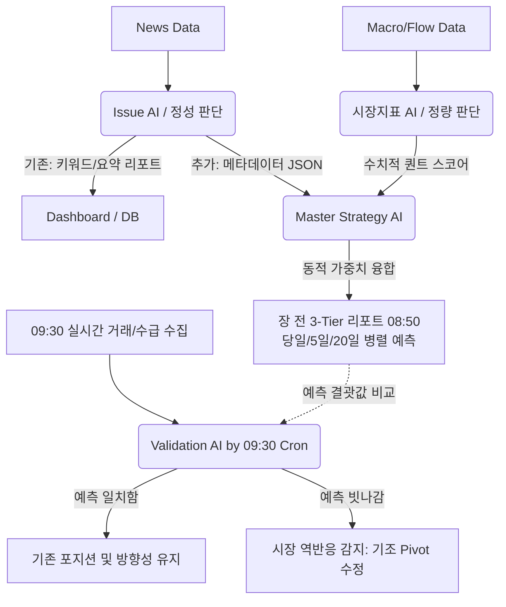

# [v2] 시황 AI(Market Intelligence) 파이프라인 개편 및 고도화 계획

## 1. 개요 및 목적
현재 모든 정보를 한 번에 덤프(Dump)하여 분석을 요청하는 단일 프롬프트(Monolithic Prompt) 방식에서 벗어나, 데이터 수집·판독·종합을 각 전문가 에이전트가 처리하고 **"Master AI(종합 분석 AI)"**가 이를 최종 조율하는 **에이전틱 워크플로우(Agentic Workflow)**로 진화합니다.
기존에 활용 중인 **Issue AI(정성적 뉴스 추출)**와 **시장지표 AI(정량적 수급 분석)**의 고유 역할을 분리·보존하면서도, 이를 지능적으로 결합하여 시장 국면(Regime)에 따라 능동적으로 예측 가중치 로직이 변하는 동적 프레임워크를 수립하는 것이 목표입니다.

---

## 2. 파이프라인 통합: `Master Strategy AI(Synthesizer)` 신설

사용자 피드백을 반영하여, 알고리즘(If-Else)으로 Issue AI와 시장지표 AI의 결과를 억지로 조율하지 않습니다. 두 전문가 AI의 브리핑 리포트를 모두 읽고 LLM의 추론 능력으로 최종 판단을 내리는 **Master Strategy AI(종합 조율 AI)** 레이어를 중간에 구축합니다. 

### 2.1 통합 프로세스 설계 (Mixture of Experts)
1. **정성적 이슈 평가 (Issue AI, 장전 08:30)**:
   * **역할 (현행 유지)**: 당일 핵심 이슈 키워드 추출 및 뉴스 요약.
   * **역할 (사이드카 추가)**: 뉴스의 [충격 강도 1~5 / 방향성 / 국면] 형태의 정형 메타데이터(JSON)를 추가로 뱉어냅니다 (예: 지정학 리스크 위기 4단계 발동!).
2. **정량적 기술 지표 평가 (시장지표 AI, 장전)**: 
   * **역할 (순수 퀀트)**: 환율, S&P 500 선물, 외인 누적 수급 등 거시 및 투자자 수급 데이터만 입력받아 **뉴스나 편향 없이 순수하게 수치와 차트를 어떻게 해석할지** 기술적 다이제스트(스코어)를 도출합니다.
3. **최종 3-Tier 리포트 생성 (Master Strategy AI, 장전 08:50)**:
   * **역할 (사령관)**: Issue AI의 "문과형 정성적 메타데이터"와 시장지표 AI의 "이과형 정량적 수치 분석"을 모두 프롬프트로 입력받아 최종 의사결정을 내립니다.
   * Master AI가 스스로 논리적 추론을 거쳐 뉴스와 수치 중 어디에 가중치를 둘지 결정합니다. (예: "수급은 상방이나 뉴스가 치명적이므로 하락 베팅")
   * **[핵심 산출물]**: 기존 장전 리포트 포맷을 100% 계승하여, **당일 / 5일 후 / 20일 후** 각각의 시계열에 대한 독립적인 등락 예측(스코어 및 방향성)을 병렬로 생성합니다. 

---

## 3. 기존 자산의 100% 활용 및 고도화 방안

### ① `Issue AI`의 파괴적 변경 방지 (Side-car 패턴 적용)
기존 `IssueTrackerAgent`의 핵심 로직(키워드 모으기, 요약하기)은 건드리지 않아 화면이나 기존 파이프라인에 영향을 주지 않습니다. 
프롬프트 하단에 메타데이터(`market_bias`, `severity`, `dominant_regime`)를 JSON으로 추가 추출하라는 지시어만 덧붙이는 **사이드카(Side-car) 방식**으로 훼손 없이 기능을 확장합니다.

### ② 정규장 09:30 크론(Cron)을 활용한 '베이지안 검증(Validation)' 루프
현재 시스템에 세팅 가능한 09:30 크론 슬롯을 활용해 **'장 초반 30분 검증(Validation) 및 스탠스 보정' 파이프라인**을 신설합니다.
* **08:50 개장 전**: Master AI가 예측 시나리오(예: "악재 반영 하락장") 도출 완료.
* **09:30 크론 발동**: 외국인/기관의 30분 누적 수급과 5분봉 등락율 데이터를 수집.
* **Validation AI 평가**: *[08:50의 사전 예측 시나리오]*와 *[09:30의 실제 시장 반응(가격/수급)]*을 대조. 사전 예측이 빗나갔다면(예: 악재 선반영 후 숏커버링으로 상승 중), 즉각 **"예측 빗나감 판정 및 시장 선반영 국면 확인 - 스탠스 Pivot (상방 전환)"** 알림을 발행.

---

## 4. 시황 AI (Market Intelligence) 아키텍처

## 5. 단계별 개발 실행 계획 (Action Plan)
현재 운영 중인 코드베이스(`IssueTrackerAgent.ts`, `MarketConditionAgent.ts`, `SchedulerService.ts`)를 깨뜨리지 않고 점진적으로 안착시키는 3단계 로드맵입니다.

**Step 1. `IssueTrackerAgent` 프롬프트에 사이드카(Side-car) 메타데이터 추가**
* **수정 대상**: `electron/services/v2_agents/IssueTrackerAgent.ts`
* **작업**:
  1. `systemPrompt`에 시장 방향성 메타데이터(`market_bias`, `dominant_regime`) JSON 리턴 강제.
  2. 얻어낸 메타데이터를 `IssueLedgerDB.getInstance().upsertIssue` 실행 시 DB 필드로 추가 반영.

**Step 2. `MarketConditionAgent`를 Master AI로 개편 (프롬프트 동적 가중치/Veto 통합)**
* **수정 대상**: `electron/services/v2_agents/prompts/market_condition.ts` (프롬프트 빌더)
* **작업**:
  1. "시장지표 AI(`TechnicalAnalyzer.ts` 등에서 나온 수급/거시경제 요약)"와 `IssueLedgerDB`에서 꺼내온 "Issue AI 메타데이터"를 모두 Prompt Context로 조립.
  2. `buildSystemPrompt` 내부에 **핵심 판독 룰(Veto Rule)** 명시: "만약 Issue 메타데이터의 충격 강도(severity)가 극단적일 경우, 시장지표 AI의 수급 긍정 평가조차 무시(Veto)하고 당일(T+1) 결과를 하방(SHORT)으로 강력 대응하라".
  3. "T+5, T+20 결과물 역시 예측하라"는 3-Tier 병렬 산출 지침 분리.

**Step 3. 09:30 베이지안 검증(Validation) 파이프라인 신설**
* **수정 대상**: `MarketConditionAgent.ts` 및 `SchedulerService.ts`
* **작업**:
  1. `MarketConditionAgent.ts` 내에 `runMorningValidation()` (또는 기존 `runIntraday` 응용) 함수 생성: 08:50에 산출된 기존 `AgentPrediction` 결과치(예상 시나리오)와 방금 수집된 최신 09:30 실제 수급 데이터(InvestorFlow)를 가져와 크로스 체크(Pivot 판단).
  2. `SchedulerService.ts`의 `initSchedules` 내부에 `cron.schedule('30 9 * * 1-5')` 크론잡을 새로 등록하고 `runMorningValidation()`을 호출하도록 연결.
